# Comprehensive LLM Learning Guide: From AI to Generative LLMs

**Complete Guide for 1-1.5 Hour Detailed Presentation**

## Table of Contents

1. [Introduction to Artificial Intelligence](#1-introduction-to-artificial-intelligence)
2. [Machine Learning Fundamentals](#2-machine-learning-fundamentals)
3. [Deep Learning Basics](#3-deep-learning-basics)
4. [Neural Networks Deep Dive](#4-neural-networks-deep-dive)
5. [Natural Language Processing Evolution](#5-natural-language-processing-evolution)
6. [The Transformer Revolution](#6-the-transformer-revolution)
7. [How LLMs Are Trained - Complete Process](#7-how-llms-are-trained---complete-process)
8. [LLM Architecture - Detailed Breakdown](#8-llm-architecture---detailed-breakdown)
9. [How LLMs Process User Queries - Step by Step](#9-how-llms-process-user-queries---step-by-step)
10. [Attention Mechanism - Deep Understanding](#10-attention-mechanism---deep-understanding)
11. [Training Data and Preprocessing](#11-training-data-and-preprocessing)
12. [Fine-tuning and Specialization](#12-fine-tuning-and-specialization)
13. [LLM Inference - Complete Flow](#13-llm-inference---complete-flow)
14. [Modern LLM Evolution](#14-modern-llm-evolution)
15. [LLM Applications and Future](#15-llm-applications-and-future)

---

## 1. Introduction to Artificial Intelligence

### What is Artificial Intelligence?

**Artificial Intelligence (AI)** is the simulation of human intelligence in machines that are programmed to think and learn like humans. The term was coined in 1956 at the Dartmouth Conference.

### History of AI

**Timeline:**
- **1950s**: Alan Turing proposes the Turing Test
- **1956**: Dartmouth Conference - AI as a field is born
- **1960s-70s**: Early AI programs (ELIZA, SHRDLU)
- **1980s**: Expert systems and knowledge-based AI
- **1990s**: Machine learning gains prominence
- **2000s**: Big data and improved algorithms
- **2010s**: Deep learning revolution
- **2020s**: Large Language Models and Generative AI

### Types of AI

1. **Narrow AI (Weak AI)**: Designed for specific tasks
   - Examples: Chess programs, voice assistants, image recognition
   
2. **General AI (Strong AI)**: Human-level intelligence across all tasks
   - Still theoretical, not yet achieved

3. **Superintelligence**: AI that surpasses human intelligence
   - Future concept

### AI Approaches

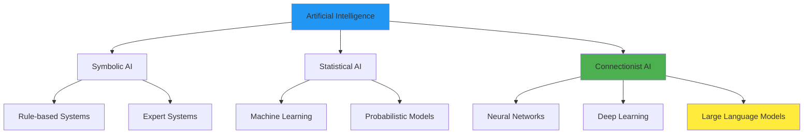

---

## 2. Machine Learning Fundamentals

### What is Machine Learning?

**Machine Learning (ML)** is a subset of AI that enables systems to learn and improve from experience without being explicitly programmed.

### Key Concepts

**Three Types of Learning:**

1. **Supervised Learning**
   - Learns from labeled data
   - Example: Email spam detection (labeled as spam/not spam)
   - Algorithms: Linear regression, decision trees, neural networks

2. **Unsupervised Learning**
   - Learns from unlabeled data
   - Example: Customer segmentation
   - Algorithms: K-means clustering, PCA

3. **Reinforcement Learning**
   - Learns through trial and error with rewards
   - Example: Game playing AI
   - Algorithms: Q-learning, policy gradients

### Machine Learning Process

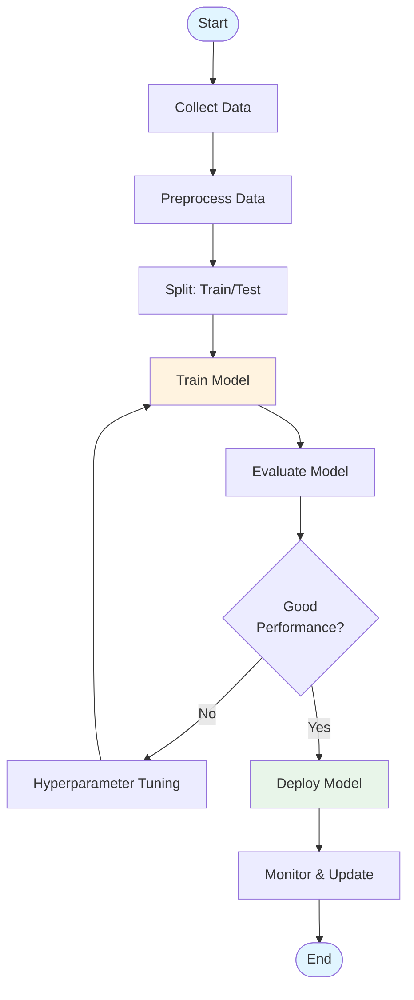

### Key ML Concepts

**Features and Labels:**
- **Features**: Input variables (X)
- **Labels**: Output variables (Y) - what we want to predict

**Training Process:**
1. Model makes predictions
2. Compare predictions with actual labels
3. Calculate error (loss)
4. Adjust model parameters to reduce error
5. Repeat until error is minimized

**Loss Function:**
- Measures how wrong the model is
- Common: Mean Squared Error (MSE), Cross-Entropy Loss

**Optimization:**
- Gradient Descent: Adjusts parameters to minimize loss
- Learning Rate: How big steps to take

---

## 3. Deep Learning Basics

### What is Deep Learning?

**Deep Learning** is a subset of machine learning that uses neural networks with multiple layers (hence "deep") to learn representations of data.

### Why Deep Learning?

**Traditional ML:**
- Requires feature engineering (manual)
- Limited to simple patterns
- Performance plateaus

**Deep Learning:**
- Automatic feature learning
- Can learn complex patterns
- Scales with data and compute

### Neural Network Basics

**Perceptron (Simplest Neural Network):**

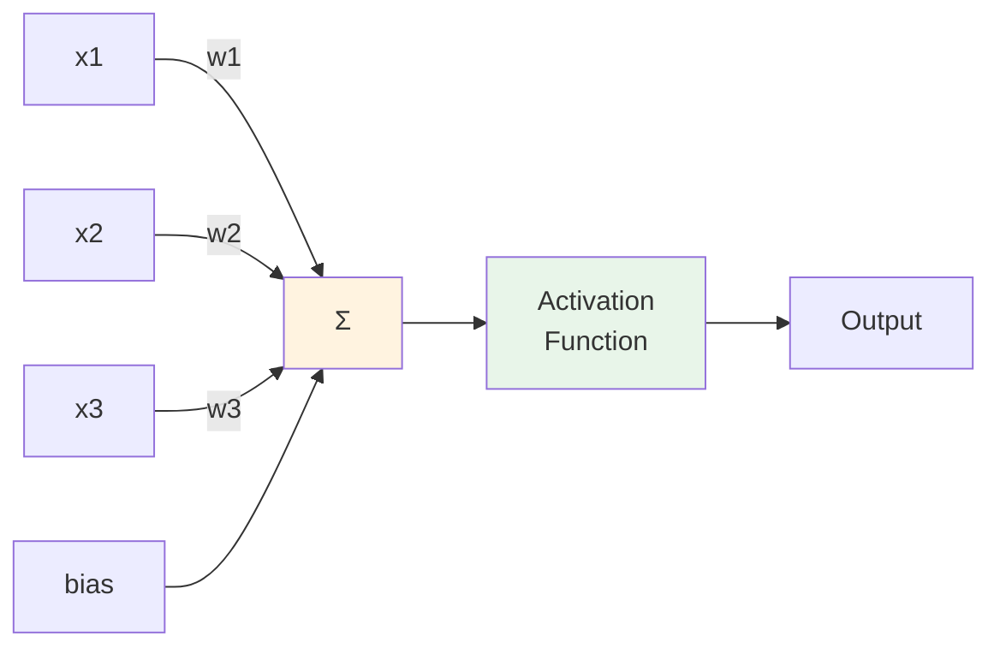

**Mathematical Representation:**
```
y = f(w1*x1 + w2*x2 + w3*x3 + bias)
```

**Activation Functions:**
- **Sigmoid**: S-shaped curve, outputs 0-1
- **ReLU**: Rectified Linear Unit, outputs 0 or positive
- **Tanh**: Hyperbolic tangent, outputs -1 to 1

### Multi-Layer Neural Network

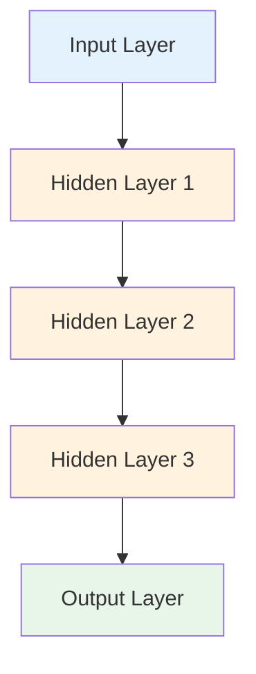

**Key Concepts:**
- **Layers**: Stack of neurons
- **Weights**: Connection strengths (learned parameters)
- **Biases**: Additional parameters
- **Forward Pass**: Data flows from input to output
- **Backward Pass**: Error flows back to adjust weights (backpropagation)

---

## 4. Neural Networks Deep Dive

### How Neural Networks Learn

**The Learning Process:**

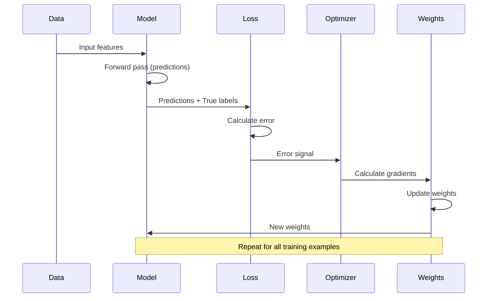

### Backpropagation Explained

**Step-by-Step:**

1. **Forward Pass**: Calculate predictions
   ```
   Input → Layer 1 → Layer 2 → ... → Output
   ```

2. **Calculate Loss**: Compare prediction with truth
   ```
   Loss = (prediction - actual)²
   ```

3. **Backward Pass**: Calculate gradients
   ```
   Gradient = ∂Loss/∂Weight
   ```

4. **Update Weights**: Move in direction that reduces loss
   ```
   New Weight = Old Weight - Learning Rate × Gradient
   ```

### Visual Representation

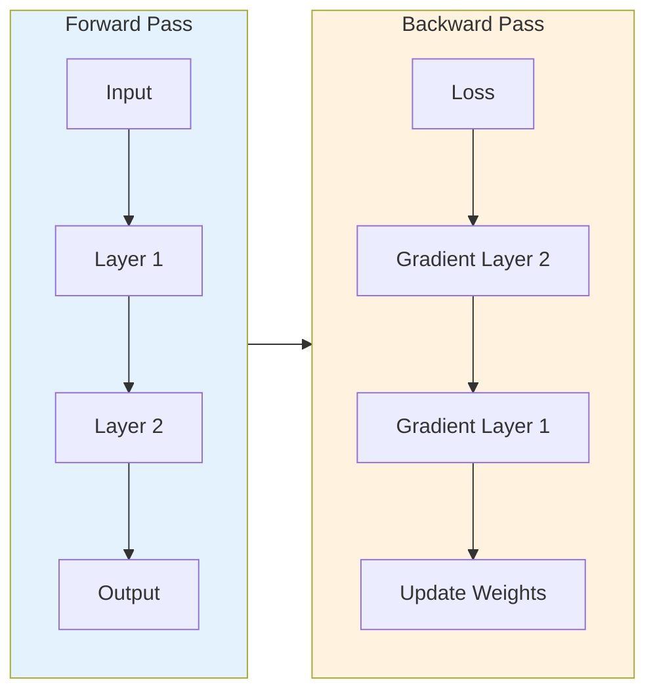

### Training a Neural Network

**Complete Training Loop:**

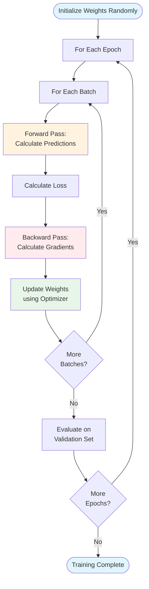

---

## 5. Natural Language Processing Evolution

### What is NLP?

**Natural Language Processing (NLP)** is a branch of AI that helps computers understand, interpret, and manipulate human language.

### Evolution of NLP

**Timeline:**

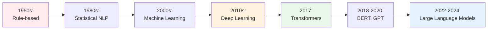

### Key NLP Tasks

1. **Text Classification**: Categorize text
2. **Named Entity Recognition**: Find names, places, etc.
3. **Machine Translation**: Translate between languages
4. **Question Answering**: Answer questions from text
5. **Text Generation**: Generate new text
6. **Sentiment Analysis**: Determine emotion/opinion

### Traditional NLP Approaches

**Rule-Based (1950s-1980s):**
- Hand-written rules
- Example: "If word ends in 'ing', it's a verb"
- Limitations: Doesn't scale, brittle

**Statistical NLP (1990s-2000s):**
- Uses probability and statistics
- Example: N-gram models, Hidden Markov Models
- Better but still limited

**Machine Learning NLP (2000s-2010s):**
- Learns patterns from data
- Example: SVM, Naive Bayes
- Better performance

### Deep Learning in NLP

**Why Deep Learning Changed NLP:**

1. **Automatic Feature Learning**: No manual feature engineering
2. **Context Understanding**: Can understand context better
3. **Transfer Learning**: Pre-trained models can be fine-tuned
4. **End-to-End Learning**: Single model for complex tasks

**Key Architectures Before Transformers:**

1. **RNN (Recurrent Neural Networks)**
   - Processes sequences one token at a time
   - Problem: Slow, hard to parallelize

2. **LSTM (Long Short-Term Memory)**
   - Better at remembering long sequences
   - Still sequential processing

3. **CNN for NLP**
   - Convolutional layers for text
   - Better parallelization but limited context

---

## 6. The Transformer Revolution

### The Problem with RNNs

**Issues:**
- Sequential processing (slow)
- Vanishing gradients (hard to train)
- Limited parallelization
- Difficulty with long-range dependencies

### The Transformer Solution

**Introduced in 2017**: "Attention Is All You Need" paper by Google

**Key Innovation**: Self-Attention mechanism

### Transformer Architecture

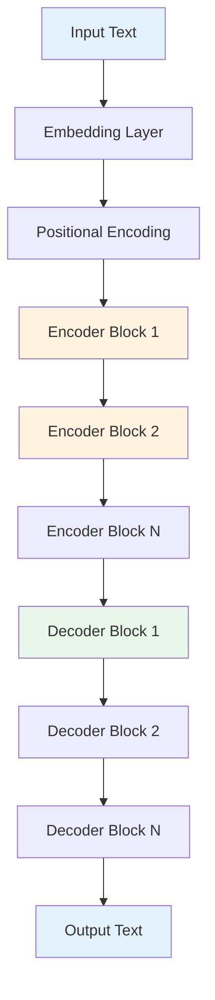

### Encoder Block Detail

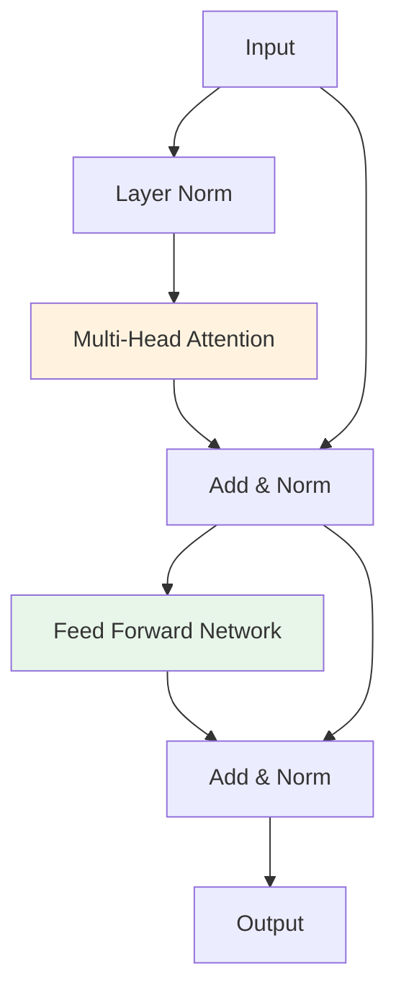

### Why Transformers Work

1. **Parallel Processing**: All tokens processed simultaneously
2. **Self-Attention**: Direct connections between any two tokens
3. **Scalability**: Easy to scale up (more layers, more parameters)
4. **Transfer Learning**: Pre-train once, fine-tune for many tasks

---

## 7. How LLMs Are Trained - Complete Process

### Overview of LLM Training

**LLM training is a massive undertaking involving:**
- Petabytes of text data
- Thousands of GPUs
- Weeks to months of compute time
- Millions of dollars in costs

### Training Pipeline

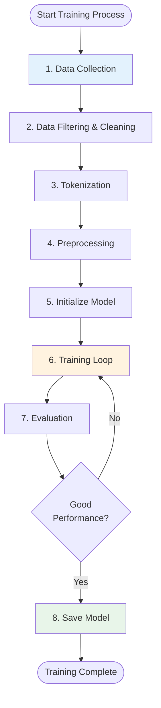

### Step 1: Data Collection

**Sources of Training Data:**

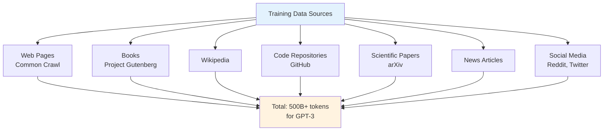

**Data Scale:**
- GPT-3: ~500 billion tokens
- GPT-4: Estimated 1-2 trillion tokens
- Total size: Petabytes of text

### Step 2: Data Filtering and Cleaning

**Process:**

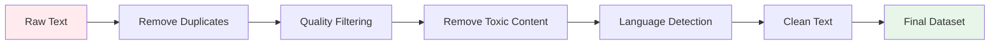

**Filtering Criteria:**
- Remove duplicates
- Filter low-quality content
- Remove toxic/harmful content
- Language detection (keep target languages)
- Remove very short or very long texts
- Balance different sources

### Step 3: Tokenization

**Process:**

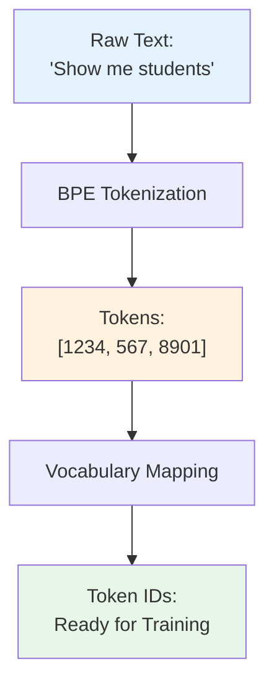

**BPE (Byte Pair Encoding) Process:**
1. Start with characters
2. Count most frequent pairs
3. Merge most frequent pair
4. Repeat until vocabulary size reached
5. Result: Subword tokens

### Step 4: Preprocessing

**Steps:**

1. **Chunking**: Split long texts into manageable chunks
2. **Context Windows**: Create sequences of fixed length (e.g., 2048 tokens)
3. **Masking**: For some tasks, mask tokens for prediction
4. **Batching**: Group sequences into batches

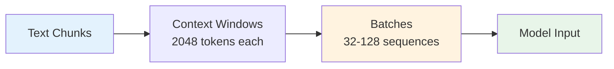

### Step 5: Model Initialization

**Initialize Weights:**

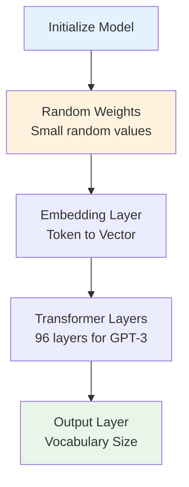

**Initialization Methods:**
- **Xavier/Glorot**: For tanh/sigmoid
- **He Initialization**: For ReLU
- **Small Random Values**: Prevent symmetry breaking

### Step 6: Training Loop - Detailed

**The Core Training Process:**

```mermaid
sequenceDiagram
    participant Data as Training Data
    participant Model as LLM Model
    participant Loss as Loss Function
    participant Opt as Optimizer
    participant GPU as GPU Cluster

    Note over Data: Training on Massive Scale
    loop For Each Batch
        Data->>Model: Batch of sequences
        Model->>Model: Forward pass through all layers
        Model->>Loss: Predictions
        Loss->>Loss: Calculate loss cross-entropy
        Loss->>Model: Error signal
        Model->>Model: Backward pass gradients
        Model->>Opt: Gradients
        Opt->>Model: Update weights
        Model->>GPU: Next batch
    end
    Note over GPU: Repeat for millions of batches
```

**Detailed Training Step:**

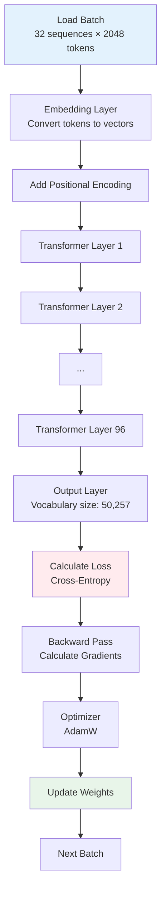

**Complete Training Step Breakdown:**

```mermaid
sequenceDiagram
    participant Data as Training Data
    participant Loader as Data Loader
    participant Model as LLM Model
    participant Loss as Loss Function
    participant Grad as Gradient Calculator
    participant Opt as Optimizer
    participant Sync as Gradient Sync

    Note over Data,Sync: Step 1: Load Batch
    Data->>Loader: Get next batch (32 sequences x 2048 tokens)
    Loader->>Model: Batch of token IDs [32, 2048]
    
    Note over Model: Step 2: Forward Pass
    Model->>Model: Embedding: [32, 2048] to [32, 2048, 768]
    Model->>Model: Add Positional Encoding
    Model->>Model: Layer 1: Self-Attention + FFN
    Model->>Model: Layer 2: Self-Attention + FFN
    Note over Model: ... (repeat for 96 layers)
    Model->>Model: Layer 96: Self-Attention + FFN
    Model->>Model: Output Layer: [32, 2048, 768] to [32, 2048, 50257]
    Model->>Loss: Logits [32, 2048, 50257]
    
    Note over Loss: Step 3: Calculate Loss
    Loss->>Loss: Cross-Entropy Loss
    Loss->>Loss: Average over batch and sequence
    Loss->>Grad: Loss value + gradients
    
    Note over Grad: Step 4: Backward Pass
    Grad->>Grad: Calculate gradients for Layer 96
    Grad->>Grad: Calculate gradients for Layer 95
    Note over Grad: ... (backpropagate through all layers)
    Grad->>Grad: Calculate gradients for Embedding
    Grad->>Sync: All gradients
    
    Note over Sync: Step 5: Synchronize
    Sync->>Sync: All-Reduce gradients across GPUs
    Sync->>Opt: Averaged gradients
    
    Note over Opt: Step 6: Update Weights
    Opt->>Opt: AdamW optimizer step
    Opt->>Model: Updated weights
    Model->>Model: Ready for next batch
    
    Note over Data,Sync: Repeat for millions of batches
```

**Forward Pass - Layer by Layer:**

```mermaid
flowchart TD
    Input[Input: [batch, seq_len, 768]] --> Norm1[Layer Norm]
    Norm1 --> QKV[Linear: Q, K, V<br/>768 to 768 each]
    QKV --> Attn[Self-Attention<br/>Calculate QK^T, softmax, V]
    Attn --> Proj[Linear Projection<br/>768 to 768]
    Proj --> Add1[Residual Add]
    Input --> Add1
    Add1 --> Norm2[Layer Norm]
    Norm2 --> FF1[FFN Layer 1<br/>768 to 3072]
    FF1 --> ReLU[ReLU Activation]
    ReLU --> FF2[FFN Layer 2<br/>3072 to 768]
    FF2 --> Add2[Residual Add]
    Add1 --> Add2
    Add2 --> Output[Output: [batch, seq_len, 768]]
    
    style Input fill:#e3f2fd
    style Attn fill:#fff3e0
    style Output fill:#e8f5e9
```

**Mathematical Operations:**

1. **Self-Attention**:
   ```
   Q = X × W_q  [batch, seq, 768]
   K = X × W_k  [batch, seq, 768]
   V = X × W_v  [batch, seq, 768]
   
   Scores = (Q × K^T) / √768  [batch, seq, seq]
   Attention = softmax(Scores) × V  [batch, seq, 768]
   ```

2. **Feed Forward**:
   ```
   FFN(x) = ReLU(x × W1 + b1) × W2 + b2
   W1: [768, 3072], W2: [3072, 768]
   ```

**Backward Pass - Gradient Flow:**

```mermaid
graph TD
    Loss[Loss Value] --> OutputGrad[Output Layer Gradients]
    OutputGrad --> Layer96[Layer 96 Gradients]
    Layer96 --> Layer95[Layer 95 Gradients]
    Layer95 --> Dots[...]
    Dots --> Layer2[Layer 2 Gradients]
    Layer2 --> Layer1[Layer 1 Gradients]
    Layer1 --> EmbedGrad[Embedding Gradients]
    
    OutputGrad --> Update96[Update Layer 96 Weights]
    Layer96 --> Update95[Update Layer 95 Weights]
    Dots --> Update2[Update Layer 2 Weights]
    Layer2 --> Update1[Update Layer 1 Weights]
    Layer1 --> UpdateEmbed[Update Embedding Weights]
    
    style Loss fill:#ffebee
    style EmbedGrad fill:#e8f5e9
```

**Optimizer: AdamW - How It Updates Weights:**

```mermaid
graph TD
    Grad[Gradients] --> M[Update Momentum<br/>m = beta1*m + (1-beta1)*g]
    Grad --> V[Update Velocity<br/>v = beta2*v + (1-beta2)*g^2]
    M --> MNorm[Normalize m<br/>m_hat = m/(1-beta1^t)]
    V --> VNorm[Normalize v<br/>v_hat = v/(1-beta2^t)]
    MNorm --> Update[Update Weight<br/>w = w - lr*(m_hat/(sqrt(v_hat) + eps) + lambda*w)]
    VNorm --> Update
    
    style Grad fill:#e3f2fd
    style Update fill:#e8f5e9
```

**Parameters:**
- **β1** = 0.9 (momentum decay)
- **β2** = 0.999 (velocity decay)
- **lr** = learning rate (starts high, decreases)
- **λ** = weight decay
- **ε** = small constant (1e-8)

**Learning Rate Schedule:**

```mermaid
graph LR
    Start[Start: lr = 6e-4] --> Warmup[Warmup Phase<br/>Increase to 6e-4<br/>over 375M tokens]
    Warmup --> Decay[Cosine Decay<br/>Decrease gradually<br/>to 10% of max]
    Decay --> End[End: lr = 6e-5]
    
    style Start fill:#e3f2fd
    style Warmup fill:#fff3e0
    style End fill:#e8f5e9
```

**Why Warmup?**
- Prevents early training instability
- Allows model to adapt gradually
- Improves final performance

**Training Statistics - GPT-3:**

- **Total Tokens**: 300 billion (after filtering)
- **Batch Size**: 3.2 million tokens per batch
- **Learning Rate**: 6e-4 (with warmup and decay)
- **Training Steps**: ~100,000 steps
- **Total Time**: ~34 days on 1,024 V100 GPUs
- **Cost**: ~$4.6 million in compute

**What the Model Learns During Training:**

```mermaid
graph TD
    Early[Early Training<br/>Steps 0-10K] --> E1[Learn basic patterns<br/>Word associations]
    Mid[Middle Training<br/>Steps 10K-50K] --> M1[Learn syntax<br/>Grammar rules]
    Late[Late Training<br/>Steps 50K-100K] --> L1[Learn semantics<br/>Meaning and context]
    Final[Final Training<br/>Steps 100K+] --> F1[Learn reasoning<br/>Complex patterns]
    
    style Early fill:#e3f2fd
    style Final fill:#e8f5e9
```

**Emergent Abilities:**
- **Few-shot learning**: Learns from examples in prompt
- **Chain-of-thought**: Step-by-step reasoning
- **Code generation**: Understands programming
- **Mathematical reasoning**: Can solve math problems

### Training Infrastructure

**Hardware Requirements:**

```mermaid
graph TD
    Infra[Training Infrastructure] --> GPUs[GPUs<br/>Thousands of A100/H100]
    Infra --> Memory[Memory<br/>Terabytes of RAM]
    Infra --> Storage[Storage<br/>Petabytes SSD/NVMe]
    Infra --> Network[Network<br/>InfiniBand/High-speed]
    
    GPUs --> Cluster[GPU Cluster<br/>Distributed Training]
    Memory --> Cluster
    Storage --> Cluster
    Network --> Cluster
    
    Cluster --> Cost[Total Cost:<br/>$2-10 Million<br/>for GPT-3 scale]
    
    style Infra fill:#e3f2fd
    style Cluster fill:#fff3e0
    style Cost fill:#ffebee
```

**Real Numbers:**
- **GPT-3 Training**: ~3,640 GPU-days on V100 GPUs
- **GPT-4 Training**: Estimated 10,000+ GPU-days on A100 GPUs
- **Cost**: $2-5 million for GPT-3, $50-100 million for GPT-4
- **Time**: Weeks to months of continuous training

**Distributed Training Architecture:**

```mermaid
graph TD
    Data[Training Data<br/>500B tokens] --> Split[Data Sharding]
    Split --> Node1[Node 1<br/>GPUs 0-7]
    Split --> Node2[Node 2<br/>GPUs 8-15]
    Split --> NodeN[Node N<br/>GPUs ...]
    
    Node1 --> Sync1[Gradient Sync]
    Node2 --> Sync2[Gradient Sync]
    NodeN --> SyncN[Gradient Sync]
    
    Sync1 --> AllReduce[All-Reduce Operation]
    Sync2 --> AllReduce
    SyncN --> AllReduce
    
    AllReduce --> Update[Update All Models]
    Update --> Next[Next Batch]
    
    style Data fill:#e3f2fd
    style AllReduce fill:#fff3e0
    style Update fill:#e8f5e9
```

**Distributed Training Methods:**
- **Data Parallelism**: Split data across GPUs
- **Model Parallelism**: Split model across GPUs
- **Pipeline Parallelism**: Split layers across GPUs
- **Mixed Precision**: FP16/BF16 for speed

### Training Objective: Next Token Prediction

**The Task:**

```mermaid
graph LR
    Context["Context:<br/>'The cat sat on the'"] --> Model[LLM Model]
    Model --> Prob[Probability Distribution<br/>over all tokens]
    Prob --> Next["Next Token:<br/>'mat' (most likely)"]
    
    style Context fill:#e3f2fd
    style Prob fill:#fff3e0
    style Next fill:#e8f5e9
```

**Mathematical Formulation:**

```
Given: "The cat sat on the"
Predict: P(next_token | "The cat sat on the")

Loss = -log(P("mat" | "The cat sat on the"))
```

**Training Process:**

```mermaid
sequenceDiagram
    participant Text as Training Text
    participant Model as LLM
    participant Loss as Loss Function
    
    Text->>Model: "The cat sat on the mat"
    Model->>Model: Process: "The cat sat on the"
    Model->>Loss: Prediction for "mat"
    Loss->>Loss: Compare with actual "mat"
    Loss->>Model: Calculate error
    Model->>Model: Update weights
    
    Note over Text,Loss: Repeat for every token in corpus
```

### Training Metrics

**What We Monitor:**

1. **Training Loss**: Should decrease over time
2. **Validation Loss**: Should track training loss
3. **Perplexity**: How "surprised" the model is
4. **Learning Rate**: Adjusted during training
5. **Gradient Norm**: Check for exploding/vanishing gradients

### Training Challenges

**Common Issues:**

1. **Overfitting**: Model memorizes training data
   - Solution: Early stopping, regularization

2. **Underfitting**: Model too simple
   - Solution: Increase model size, more training

3. **Catastrophic Forgetting**: Forgets previous knowledge
   - Solution: Careful fine-tuning

4. **Computational Cost**: Extremely expensive
   - Solution: Efficient architectures, mixed precision

---

## 8. LLM Architecture - Detailed Breakdown

### Complete LLM Architecture

```mermaid
graph TD
    Input[Input Text] --> Token[Tokenization]
    Token --> Embed[Embedding Layer<br/>Token to 768-dim vector]
    Embed --> PosEnc[Positional Encoding<br/>Add position info]
    PosEnc --> Layer1[Transformer Block 1]
    
    Layer1 --> Layer2[Transformer Block 2]
    Layer2 --> Dots[...]
    Dots --> LayerN[Transformer Block N<br/>N = 96 for GPT-3]
    
    LayerN --> Norm[Layer Normalization]
    Norm --> Output[Output Layer<br/>Vocabulary size]
    Output --> Prob[Probability Distribution]
    Prob --> Sample[Sample Next Token]
    
    style Input fill:#e3f2fd
    style Layer1 fill:#fff3e0
    style Output fill:#e8f5e9
```

### Transformer Block Detail

**Single Transformer Block:**

```mermaid
graph TD
    Input[Input Vectors] --> Norm1[Layer Norm 1]
    Norm1 --> Attn[Multi-Head Self-Attention]
    Attn --> Add1[Residual Connection]
    Input --> Add1
    Add1 --> Norm2[Layer Norm 2]
    Norm2 --> FFN[Feed Forward Network]
    FFN --> Add2[Residual Connection]
    Add1 --> Add2
    Add2 --> Output[Output Vectors]
    
    style Attn fill:#fff3e0
    style FFN fill:#e8f5e9
```

### Embedding Layer

**How It Works:**

```mermaid
graph LR
    Token["Token ID:<br/>1234"] --> Lookup[Embedding Lookup]
    Lookup --> Vector["Vector:<br/>[0.2, -0.5, 0.8, ...]<br/>768 dimensions"]
    
    style Token fill:#e3f2fd
    style Vector fill:#e8f5e9
```

**Embedding Matrix:**
- Size: Vocabulary × Embedding Dimension
- Example: 50,257 tokens × 768 dimensions = ~38M parameters
- Learned during training

### Positional Encoding

**Why Needed:**
- Transformers don't have inherent order
- Need to know token positions

**Methods:**

1. **Sinusoidal Encoding** (Original Transformer)
   ```
   PE(pos, 2i) = sin(pos / 10000^(2i/d_model))
   PE(pos, 2i+1) = cos(pos / 10000^(2i/d_model))
   ```

2. **Learned Positional Embeddings** (GPT, BERT)
   - Learned during training
   - Similar to token embeddings

```mermaid
graph TD
    Token[Token Embedding] --> Add[Add]
    Pos[Position Embedding] --> Add
    Add --> Final[Final Embedding]
    
    style Token fill:#e3f2fd
    style Pos fill:#fff3e0
    style Final fill:#e8f5e9
```

### Feed Forward Network

**Structure:**

```mermaid
graph LR
    Input[Input<br/>768 dim] --> Linear1[Linear Layer 1<br/>768 to 3072]
    Linear1 --> ReLU[ReLU Activation]
    ReLU --> Linear2[Linear Layer 2<br/>3072 to 768]
    Linear2 --> Output[Output<br/>768 dim]
    
    style Input fill:#e3f2fd
    style ReLU fill:#fff3e0
    style Output fill:#e8f5e9
```

**Mathematical:**
```
FFN(x) = max(0, xW1 + b1)W2 + b2
```

---

## 9. How LLMs Process User Queries - Step by Step

### Complete Query Processing Flow

```mermaid
flowchart TD
    User[User Query] --> Tokenize[Step 1: Tokenization]
    Tokenize --> Embed[Step 2: Embedding]
    Embed --> PosEnc[Step 3: Positional Encoding]
    PosEnc --> Layer1[Step 4: Process Layer 1]
    Layer1 --> Layer2[Step 5: Process Layer 2]
    Layer2 --> Dots[Step 6-N: Process Layers 3-96]
    Dots --> Output[Step N+1: Output Layer]
    Output --> Prob[Step N+2: Probability Distribution]
    Prob --> Sample[Step N+3: Sample Next Token]
    Sample --> Add[Step N+4: Add to Sequence]
    Add --> Check{Complete?}
    Check -->|No| Tokenize
    Check -->|Yes| Result[Final Result]
    
    style User fill:#e3f2fd
    style Prob fill:#fff3e0
    style Result fill:#e8f5e9
```

### Step-by-Step Detailed Process

#### Step 1: Tokenization (Detailed)

**Example Query: "Show me all students enrolled in 2024"**

```mermaid
graph TD
    Text["User Input:<br/>'Show me all students enrolled in 2024'"] --> Preprocess[Preprocessing<br/>Normalize, clean]
    Preprocess --> Split[Split into subwords]
    Split --> BPE[Apply BPE merges]
    BPE --> Lookup[Vocabulary Lookup]
    Lookup --> Tokens["Token IDs:<br/>[1234, 567, 890, 12345, 6789, 12, 2024]"]
    Tokens --> Shape["Shape: [1, 7]<br/>1 sequence, 7 tokens"]
    
    style Text fill:#e3f2fd
    style Tokens fill:#e8f5e9
```

**Detailed Process:**
1. Text normalization (lowercase, remove extra spaces)
2. Split into subwords using BPE
3. Look up each subword in vocabulary (50,257 tokens)
4. Convert to token IDs
5. Result: Array of integers

#### Step 2: Embedding (Detailed)

```mermaid
sequenceDiagram
    participant Tokens as Token IDs
    participant Embed as Embedding Matrix
    participant Result as Embeddings

    Tokens->>Embed: [1234, 567, 890, ...]
    Note over Embed: Embedding Matrix:<br/>[50257, 768]<br/>50,257 tokens × 768 dimensions
    Embed->>Embed: Lookup row 1234 to vector[768]
    Embed->>Embed: Lookup row 567 to vector[768]
    Embed->>Embed: Lookup row 890 to vector[768]
    Note over Embed: ... (for all tokens)
    Embed->>Result: Embeddings: [1, 7, 768]<br/>1 batch, 7 tokens, 768 dims
    
    style Tokens fill:#e3f2fd
    style Result fill:#e8f5e9
```

**Mathematical:**
```
Embedding = Embedding_Matrix[token_ids]
Shape: [1, 7] → [1, 7, 768]
```

**Process:**
- Each token ID → lookup in embedding matrix
- Get corresponding vector
- Result: Matrix of shape [batch_size, sequence_length, embedding_dim]

#### Step 3: Positional Encoding

```mermaid
graph LR
    Embed[Token Embeddings] --> Add[Add]
    Pos[Position Embeddings] --> Add
    Add --> Final[Final Embeddings<br/>with position info]
    
    style Embed fill:#e3f2fd
    style Final fill:#e8f5e9
```

**Process:**
- Add position information to each token
- Position 0, 1, 2, ... encoded
- Result: Embeddings now include position

#### Step 4-N: Transformer Layers (Ultra Detailed)

**What Happens in Each Transformer Layer:**

```mermaid
flowchart TD
    Input["Input: [1, 7, 768]<br/>7 tokens, 768 dimensions"] --> Norm1[Layer Norm 1]
    Norm1 --> QKV[Linear Transformations<br/>Q, K, V: 768 to 768]
    
    QKV --> Q["Q: [1, 7, 768]<br/>What am I looking for?"]
    QKV --> K["K: [1, 7, 768]<br/>What do I contain?"]
    QKV --> V["V: [1, 7, 768]<br/>What info do I have?"]
    
    Q --> Scores[Calculate Scores<br/>Q × K^T / √768]
    K --> Scores
    Scores --> Softmax[Softmax<br/>Convert to probabilities]
    Softmax --> Weights["Attention Weights<br/>[1, 7, 7]<br/>7×7 matrix"]
    
    Weights --> Weighted[Weighted Sum<br/>Weights × V]
    V --> Weighted
    Weighted --> Proj[Linear Projection<br/>768 to 768]
    Proj --> Add1[Residual Add]
    Input --> Add1
    Add1 --> Norm2[Layer Norm 2]
    Norm2 --> FF1[FFN Layer 1<br/>768 to 3072]
    FF1 --> ReLU[ReLU]
    ReLU --> FF2[FFN Layer 2<br/>3072 to 768]
    FF2 --> Add2[Residual Add]
    Add1 --> Add2
    Add2 --> Output["Output: [1, 7, 768]<br/>Refined understanding"]
    
    style Input fill:#e3f2fd
    style Weights fill:#fff3e0
    style Output fill:#e8f5e9
```

**Attention Weights Example:**

When processing token "students" (position 2):

```
Attention weights for "students":
┌─────────┬──────────┬─────────┬─────────┬─────────┬─────────┬─────────┐
│  Show   │   me     │ students│ enrolled│    in   │   2024  │   </w>  │
├─────────┼──────────┼─────────┼─────────┼─────────┼─────────┼─────────┤
│   0.05  │   0.10   │   1.00  │   0.85  │   0.60  │   0.40  │   0.20  │
└─────────┴──────────┴─────────┴─────────┴─────────┴─────────┴─────────┘
         ↑                    ↑                    ↑
    Low attention        High attention      Medium attention
```

**What Happens in Each Layer:**

1. **Self-Attention**:
   - Each token "attends" to all other tokens
   - Calculates relationships
   - Creates context-aware representations
   - Mathematical: Attention(Q,K,V) = softmax(QK^T/√d_k) × V

2. **Feed Forward**:
   - Processes each position independently
   - Adds non-linearity
   - Refines features
   - Mathematical: FFN(x) = ReLU(xW1 + b1)W2 + b2

3. **Residual Connections**:
   - Adds input to output
   - Helps with gradient flow
   - Enables deep networks

**Visual Flow Through Layers:**

```mermaid
graph TD
    L0[Layer 0 Input<br/>Raw embeddings] --> L1[Layer 1<br/>Basic patterns]
    L1 --> L2[Layer 2<br/>Word relationships]
    L2 --> L3[Layer 3<br/>Phrase understanding]
    L3 --> Dots[...]
    Dots --> L48[Layer 48<br/>Complex reasoning]
    L48 --> L96[Layer 96<br/>Final understanding]
    
    style L0 fill:#e3f2fd
    style L96 fill:#e8f5e9
```

#### Step N+1: Output Layer (Detailed)

**Final Processing:**

```mermaid
sequenceDiagram
    participant LastLayer as Layer 96 Output
    participant Linear as Linear Layer
    participant Logits as Logits
    participant Softmax as Softmax
    participant Prob as Probabilities

    LastLayer->>Linear: [1, 7, 768]
    Note over Linear: Weight Matrix:<br/>[768, 50257]<br/>768 to 50,257
    Linear->>Logits: [1, 7, 50257]<br/>Raw scores for each token
    Logits->>Softmax: Apply softmax per position
    Note over Softmax: exp(logit_i) / Σexp(logit_j)<br/>for each position
    Softmax->>Prob: [1, 7, 50257]<br/>Probabilities sum to 1.0
    
    style LastLayer fill:#e3f2fd
    style Prob fill:#e8f5e9
```

**For Last Token (position 6):**

```
Logits for position 6 (after "in"):
- Token 12345 ("2024"): 8.5
- Token 567 ("enrolled"): 6.2
- Token 890 ("students"): 5.1
- ... (50,254 more tokens)

After Softmax:
- Token 12345 ("2024"): 0.40 (40% probability)
- Token 567 ("enrolled"): 0.15
- Token 890 ("students"): 0.08
- ... (sum = 1.0)
```

**Mathematical:**
```
logits = W × hidden_state + b
probabilities = softmax(logits)
```

#### Step N+2: Sampling Next Token

**Process:**

```mermaid
graph TD
    Prob[Probability Distribution<br/>over 50,257 tokens] --> Strategy{Sampling<br/>Strategy}
    Strategy -->|Greedy| Greedy[Pick highest<br/>probability]
    Strategy -->|Temperature| Temp[Apply temperature<br/>add randomness]
    Strategy -->|Top-k| TopK[Sample from<br/>top k tokens]
    Strategy -->|Top-p| TopP[Sample from<br/>top p probability mass]
    Greedy --> Token[Selected Token]
    Temp --> Token
    TopK --> Token
    TopP --> Token
    
    style Prob fill:#e3f2fd
    style Token fill:#e8f5e9
```

**Example:**
```
Probabilities:
- "enrolled" = 0.35
- "in" = 0.25
- "with" = 0.15
- "from" = 0.10
- ... (50,253 more tokens)

Selected: "enrolled" (highest probability)
```

#### Step N+3: Iterative Generation

**Complete Generation Loop:**

```mermaid
sequenceDiagram
    participant User
    participant Model
    participant Output

    User->>Model: "Show me students"
    Model->>Model: Process through 96 layers
    Model->>Output: "enrolled" (probability: 0.35)
    Output->>Model: "Show me students enrolled"
    Model->>Model: Process again
    Model->>Output: "in" (probability: 0.25)
    Output->>Model: "Show me students enrolled in"
    Model->>Model: Process again
    Model->>Output: "2024" (probability: 0.40)
    Output->>User: "Show me students enrolled in 2024"
```

**Visual Representation:**

```mermaid
graph LR
    S1["Step 1:<br/>'Show me students'"] --> T1[Generate: 'enrolled']
    T1 --> S2["Step 2:<br/>'Show me students enrolled'"]
    S2 --> T2[Generate: 'in']
    T2 --> S3["Step 3:<br/>'Show me students enrolled in'"]
    S3 --> T3[Generate: '2024']
    T3 --> Final["Final:<br/>'Show me students enrolled in 2024'"]
    
    style S1 fill:#e3f2fd
    style Final fill:#e8f5e9
```

### Complete Example: Processing "Show me students"

**Detailed Step-by-Step:**

```mermaid
flowchart TD
    Start["User: 'Show me students'"] --> T1[Tokenize]
    T1 --> T1R["Tokens: [1234, 567, 8901]"]
    T1R --> E1[Embed]
    E1 --> E1R["Vectors: 3 × 768 matrix"]
    E1R --> P1[Add Position]
    P1 --> P1R["With positions: 0, 1, 2"]
    P1R --> L1[Layer 1: Attention]
    L1 --> L1A["Attention scores calculated"]
    L1A --> L1F[Layer 1: FFN]
    L1F --> L2[Layer 2]
    L2 --> Dots[...]
    Dots --> L96[Layer 96]
    L96 --> Out[Output Layer]
    Out --> Logits["Logits: [50,257 scores]"]
    Logits --> Softmax[Softmax]
    Softmax --> Probs["Probabilities:<br/>'enrolled': 0.35<br/>'in': 0.25<br/>..."]
    Probs --> Sample[Sample: 'enrolled']
    Sample --> Add["Add: 'Show me students enrolled'"]
    Add --> Repeat[Repeat process]
    Repeat --> Final["Final: Complete sentence"]
    
    style Start fill:#e3f2fd
    style Probs fill:#fff3e0
    style Final fill:#e8f5e9
```

### Complete Processing Timeline

**Time Breakdown (Approximate):**

```mermaid
gantt
    title LLM Query Processing Timeline
    dateFormat X
    axisFormat %Ls
    
    section Tokenization
    Tokenize text          :0, 1ms
    
    section Embedding
    Lookup embeddings      :1, 2ms
    
    section Processing
    Layer 1-32            :3, 50ms
    Layer 33-64           :53, 50ms
    Layer 65-96           :103, 50ms
    
    section Output
    Generate probabilities :153, 5ms
    Sample token          :158, 1ms
    
    section Total
    Total time            :0, 160ms
```

**Real Numbers:**
- **Tokenization**: < 1ms
- **Embedding**: ~2ms
- **96 Layers**: ~150ms (on GPU)
- **Output + Sampling**: ~5ms
- **Total**: ~160ms per token
- **For 10 tokens**: ~1.6 seconds

---

## 10. Attention Mechanism - Deep Understanding

### What is Attention?

**Attention** allows the model to focus on relevant parts of the input when processing each token.

### Self-Attention Mechanism

**Complete Process:**

```mermaid
graph TD
    Input[Input Vectors] --> Q[Query Q<br/>What am I looking for?]
    Input --> K[Key K<br/>What do I contain?]
    Input --> V[Value V<br/>What information do I have?]
    
    Q --> Scores[Calculate Attention Scores<br/>Q × K^T]
    K --> Scores
    Scores --> Scale[Scale by √d_k]
    Scale --> Softmax[Softmax<br/>Convert to probabilities]
    Softmax --> Weight[Attention Weights]
    
    Weight --> Weighted[Weighted Sum<br/>Weights × Values]
    V --> Weighted
    Weighted --> Output[Output Vectors]
    
    style Input fill:#e3f2fd
    style Scores fill:#fff3e0
    style Output fill:#e8f5e9
```

### Attention Calculation - Step by Step

**Mathematical Process:**

```mermaid
sequenceDiagram
    participant Input
    participant QKV as Q, K, V
    participant Scores
    participant Softmax
    participant Output

    Input->>QKV: Linear transformations
    Note over QKV: Q = XW_q, K = XW_k, V = XW_v
    QKV->>Scores: Q × K^T
    Note over Scores: Attention(Q,K,V) = softmax(QK^T/√d_k) × V
    Scores->>Softmax: Apply softmax
    Softmax->>Output: Multiply with V
    Output->>Output: Context-aware vectors
```

### Multi-Head Attention

**Why Multiple Heads?**

```mermaid
graph TD
    Input[Input] --> H1[Head 1<br/>Syntax Relationships]
    Input --> H2[Head 2<br/>Semantic Meaning]
    Input --> H3[Head 3<br/>Long-range Dependencies]
    Input --> H4[Head N<br/>Other Patterns]
    
    H1 --> Concat[Concatenate]
    H2 --> Concat
    H3 --> Concat
    H4 --> Concat
    Concat --> Linear[Linear Projection]
    Linear --> Output[Output]
    
    style Input fill:#e3f2fd
    style H1 fill:#fff3e0
    style H2 fill:#e8f5e9
    style H3 fill:#f3e5f5
    style Output fill:#e1f5ff
```

**Example:**
- **Head 1**: Focuses on grammatical relationships (subject-verb)
- **Head 2**: Focuses on meaning (cat → animal)
- **Head 3**: Focuses on long-distance dependencies
- **Head 4-12**: Other patterns

### Attention Visualization

**Example: "The cat sat on the mat because it was tired"**

```mermaid
graph TD
    Words["Words:<br/>The cat sat on the mat because it was tired"]
    Words --> Attn[Attention when processing 'it']
    Attn --> Scores["Scores:<br/>'it' to 'cat': 0.9<br/>'it' to 'mat': 0.1<br/>'it' to 'sat': 0.2<br/>..."]
    Scores --> Result["Result:<br/>'it' refers to 'cat'"]
    
    style Words fill:#e3f2fd
    style Scores fill:#fff3e0
    style Result fill:#e8f5e9
```

---

## 11. Training Data and Preprocessing

### Data Collection at Scale

**The Challenge:**
- Need massive amounts of high-quality text
- Must be diverse and representative
- Must be clean and safe

### Data Sources Breakdown

```mermaid
pie title Training Data Sources for GPT-3
    "Common Crawl (Web)" : 60
    "Books" : 22
    "Wikipedia" : 3
    "Code (GitHub)" : 5
    "News Articles" : 5
    "Other" : 5
```

### Data Preprocessing Pipeline

```mermaid
flowchart TD
    Raw[Raw Text Data<br/>Petabytes] --> Dedup[1. Deduplication<br/>Remove exact duplicates]
    Dedup --> Quality[2. Quality Filtering<br/>Remove low-quality text]
    Quality --> Toxic[3. Toxicity Filtering<br/>Remove harmful content]
    Toxic --> Lang[4. Language Detection<br/>Keep target languages]
    Lang --> Length[5. Length Filtering<br/>Remove too short/long]
    Length --> Format[6. Format Normalization<br/>Clean formatting]
    Format --> Chunk[7. Chunking<br/>Split into sequences]
    Chunk --> Final[Final Training Data<br/>Ready for tokenization]
    
    style Raw fill:#ffebee
    style Final fill:#e8f5e9
```

### Quality Filtering

**Criteria:**

1. **Perplexity**: Remove text that's too random
2. **Repetition**: Remove highly repetitive text
3. **Length**: Keep reasonable length texts
4. **Language**: Filter by language
5. **Content**: Remove low-information content

### Data Statistics

**GPT-3 Training Data:**
- **Total Tokens**: ~500 billion
- **Sources**: 45+ TB of text
- **Languages**: Primarily English, some multilingual
- **Time Period**: Up to October 2021
- **Processing**: Months of filtering and cleaning

---

## 12. Fine-tuning and Specialization

### Why Fine-tuning?

**Pre-trained models are generalists. Fine-tuning makes them specialists.**

```mermaid
graph LR
    Base[Base LLM<br/>General Knowledge] --> FT[Fine-tuning]
    FT --> Specialized[Specialized Model<br/>Task-Specific]
    
    style Base fill:#e3f2fd
    style FT fill:#fff3e0
    style Specialized fill:#e8f5e9
```

### Types of Fine-tuning

**1. Supervised Fine-tuning (SFT):**

```mermaid
graph TD
    Base[Pre-trained Model] --> Examples[Labeled Examples]
    Examples --> Train[Train on Examples]
    Train --> SFT[Fine-tuned Model]
    
    style Base fill:#e3f2fd
    style SFT fill:#e8f5e9
```

**Example:**
```
Input: "What is SQL?"
Output: "SQL is a programming language for databases..."
```

**2. Instruction Tuning:**

```mermaid
graph TD
    Base[Base Model] --> Instructions[Instruction Examples]
    Instructions --> IT[Instruction Tuning]
    IT --> Instruct[Instruction-Following Model]
    
    style Base fill:#e3f2fd
    style Instruct fill:#e8f5e9
```

**3. Reinforcement Learning from Human Feedback (RLHF):**

```mermaid
sequenceDiagram
    participant Model
    participant Human
    participant Reward
    participant RL

    Model->>Human: Generate response
    Human->>Reward: Rate response (1-5)
    Reward->>RL: Reward signal
    RL->>Model: Update to maximize reward
    Note over Model,RL: Repeat to improve responses
```

### Fine-tuning Process

```mermaid
flowchart TD
    Start[Start Fine-tuning] --> Load[Load Pre-trained Model]
    Load --> Data[Prepare Task-Specific Data]
    Data --> Freeze[Freeze Most Layers]
    Freeze --> Train[Train Last Few Layers]
    Train --> Eval[Evaluate Performance]
    Eval --> Good{Good?}
    Good -->|No| Train
    Good -->|Yes| Save[Save Fine-tuned Model]
    Save --> End([Done])
    
    style Start fill:#e3f2fd
    style Train fill:#fff3e0
    style Save fill:#e8f5e9
```

---

## 13. LLM Inference - Complete Flow

### Inference vs Training

**Key Differences:**

```mermaid
graph LR
    subgraph Training["Training"]
        T1[Forward Pass] --> T2[Calculate Loss]
        T2 --> T3[Backward Pass]
        T3 --> T4[Update Weights]
        T4 --> T1
    end
    
    subgraph Inference["Inference"]
        I1[Forward Pass] --> I2[Generate Token]
        I2 --> I3[Add to Sequence]
        I3 --> I4{Complete?}
        I4 -->|No| I1
        I4 -->|Yes| I5[Return Result]
    end
    
    style Training fill:#fff3e0
    style Inference fill:#e8f5e9
```

### Complete Inference Process

**Step-by-Step:**

```mermaid
flowchart TD
    Query[User Query] --> Token[1. Tokenize]
    Token --> Embed[2. Embed]
    Embed --> Process[3. Process Through Model]
    Process --> Output[4. Output Probabilities]
    Output --> Sample[5. Sample Token]
    Sample --> Add[6. Add to Sequence]
    Add --> Check{7. Complete?}
    Check -->|No| Process
    Check -->|Yes| Result[8. Return Result]
    
    style Query fill:#e3f2fd
    style Result fill:#e8f5e9
```

### Inference Optimization

**Techniques:**

1. **KV Caching**: Cache key-value pairs to avoid recomputation
2. **Quantization**: Use lower precision (FP16, INT8)
3. **Pruning**: Remove unnecessary weights
4. **Distillation**: Smaller model learns from larger

---

## 14. Modern LLM Evolution

### Evolution Timeline

```mermaid
graph TD
    T2017[2017: Transformer] --> T2018[2018: BERT, GPT-1]
    T2018 --> T2019[2019: GPT-2<br/>1.5B parameters]
    T2019 --> T2020[2020: GPT-3<br/>175B parameters]
    T2020 --> T2022[2022: ChatGPT<br/>GPT-3.5]
    T2022 --> T2023[2023: GPT-4<br/>~1.7T parameters]
    T2023 --> T2024[2024: Current<br/>Claude, Gemini, Llama]
    
    style T2017 fill:#e3f2fd
    style T2020 fill:#fff3e0
    style T2024 fill:#e8f5e9
```

### Model Size Growth

```mermaid
graph LR
    G1[GPT-1<br/>117M] --> G2[GPT-2<br/>1.5B]
    G2 --> G3[GPT-3<br/>175B]
    G3 --> G4[GPT-4<br/>~1.7T]
    
    style G1 fill:#e3f2fd
    style G4 fill:#e8f5e9
```

### Key Innovations

1. **Scaling**: Bigger models = better performance
2. **Architecture**: Improved transformer variants
3. **Training**: Better data and methods
4. **Alignment**: RLHF for helpfulness

---

## 15. LLM Applications and Future

### Current Applications

1. **Text Generation**: Writing, content creation
2. **Code Generation**: GitHub Copilot, coding assistants
3. **Translation**: Multi-language support
4. **Question Answering**: Chatbots, assistants
5. **Summarization**: Long text → short summary
6. **NL2SQL**: Your project - natural language to SQL

### Future Directions

1. **Multimodal**: Text + Images + Audio
2. **Reasoning**: Better logical reasoning
3. **Efficiency**: Smaller, faster models
4. **Safety**: Better alignment and control
5. **Specialization**: Domain-specific models

---

**End of Comprehensive Guide**

*This guide provides deep understanding of LLMs from basics to advanced topics. Study each chapter thoroughly for your detailed presentation.*

