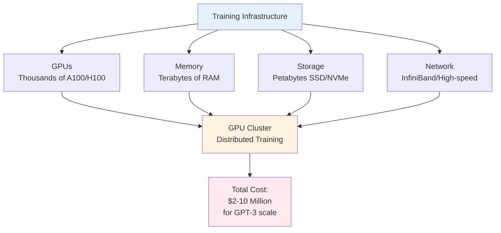
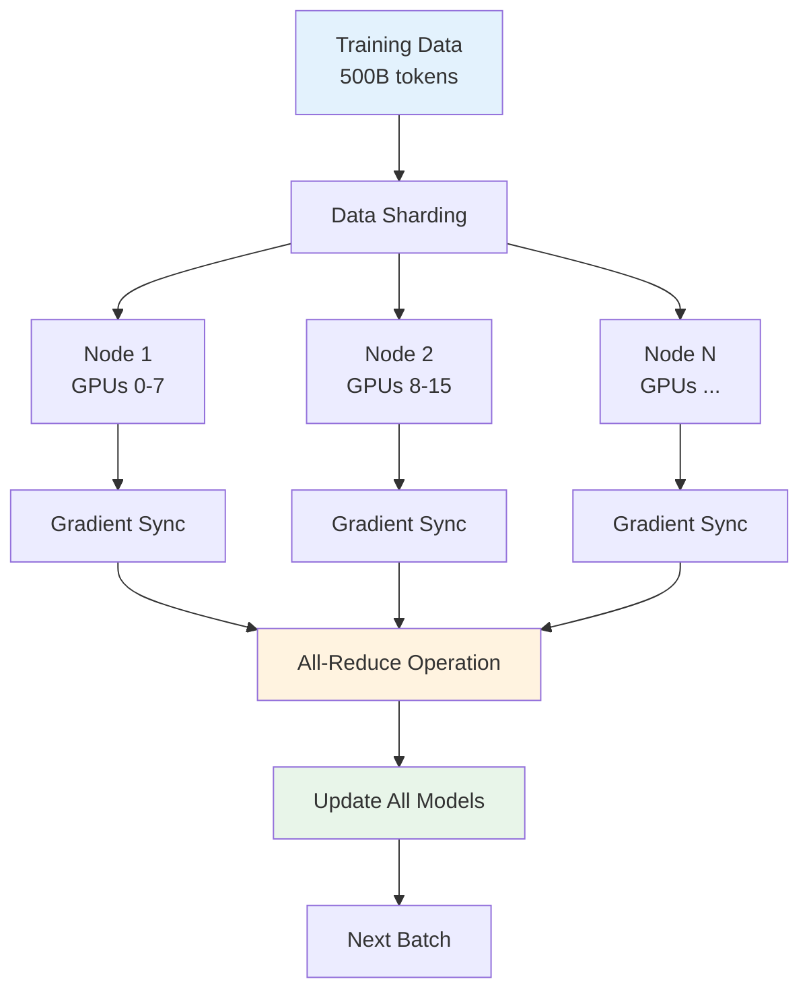
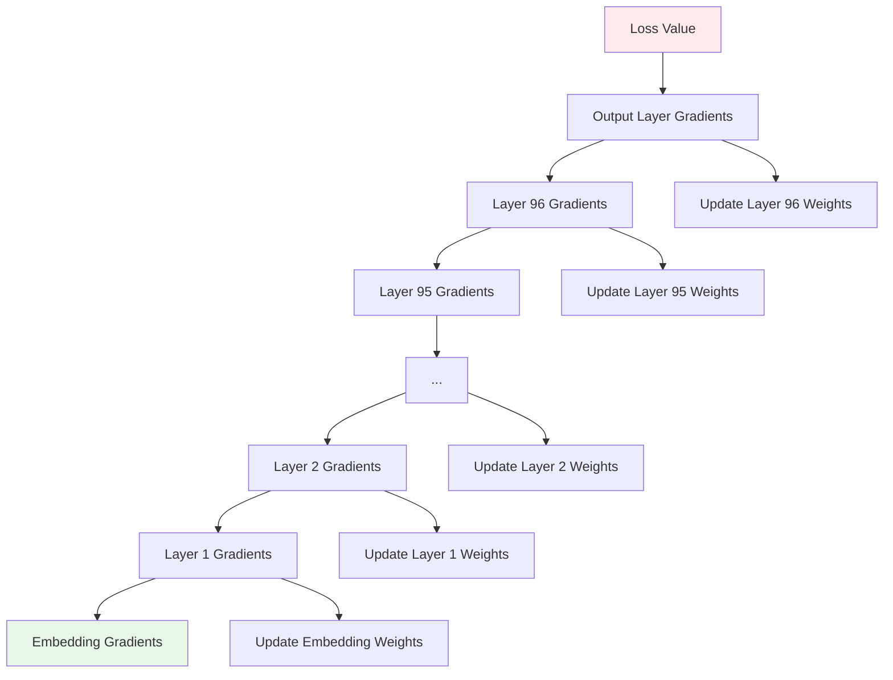
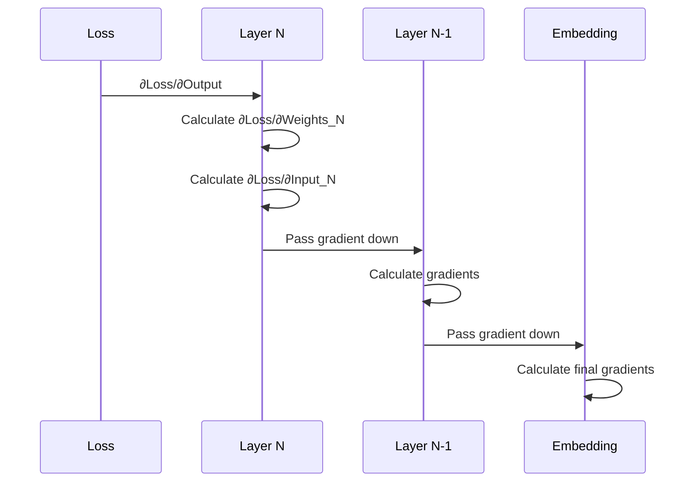
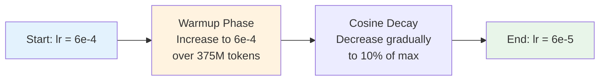
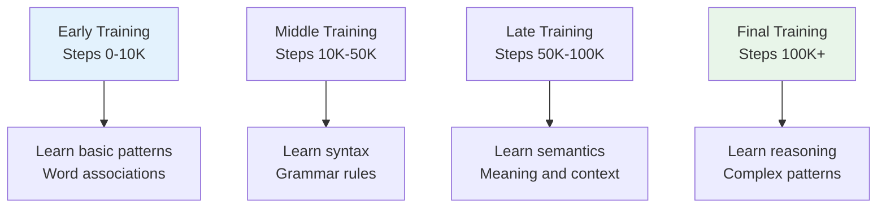
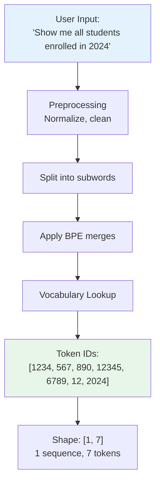
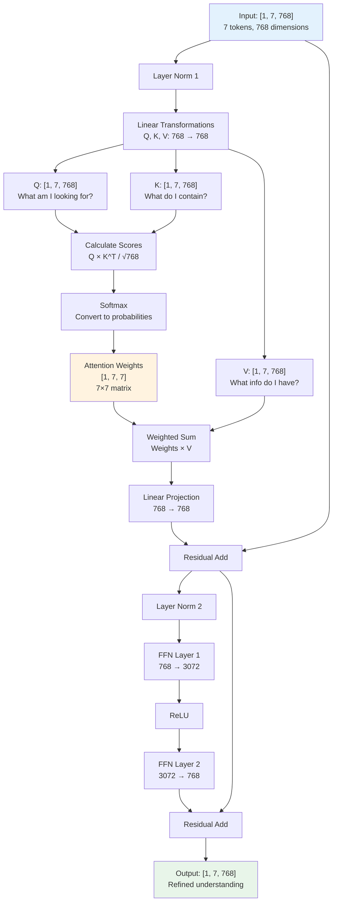
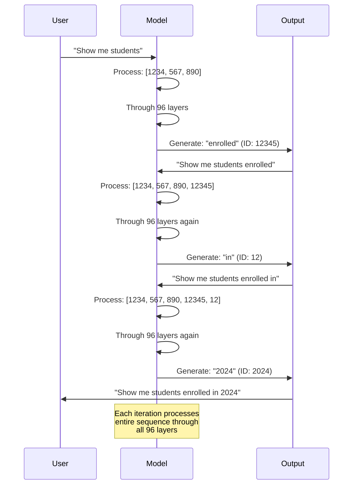

# Expanded Training Details - How LLMs Are Trained on Vast Amounts of Data

## Complete Training Process - Ultra Detailed

### The Actual Training Scenario

### Infrastructure Setup

**Hardware Requirements:**



**Real Numbers:**
- **GPT-3 Training**: ~3,640 GPU-days on V100 GPUs
- **GPT-4 Training**: Estimated 10,000+ GPU-days on A100 GPUs
- **Cost**: $2-5 million for GPT-3, $50-100 million for GPT-4
- **Time**: Weeks to months of continuous training

### Distributed Training Architecture

**How Training is Distributed:**



### Complete Training Loop - Ultra Detailed

**Single Training Step Breakdown:**

```mermaid
sequenceDiagram
    participant Data as Training Data
    participant Loader as Data Loader
    participant Model as LLM Model
    participant Loss as Loss Function
    participant Grad as Gradient Calculator
    participant Opt as Optimizer
    participant Sync as Gradient Sync

    Note over Data,Sync: Step 1: Load Batch
    Data->>Loader: Get next batch (32 sequences × 2048 tokens)
    Loader->>Model: Batch of token IDs [32, 2048]
    
    Note over Model: Step 2: Forward Pass
    Model->>Model: Embedding: [32, 2048] → [32, 2048, 768]
    Model->>Model: Add Positional Encoding
    Model->>Model: Layer 1: Self-Attention + FFN
    Model->>Model: Layer 2: Self-Attention + FFN
    Note over Model: ... (repeat for 96 layers)
    Model->>Model: Layer 96: Self-Attention + FFN
    Model->>Model: Output Layer: [32, 2048, 768] → [32, 2048, 50257]
    Model->>Loss: Logits [32, 2048, 50257]
    
    Note over Loss: Step 3: Calculate Loss
    Loss->>Loss: Cross-Entropy Loss
    Loss->>Loss: Average over batch and sequence
    Loss->>Grad: Loss value + gradients
    
    Note over Grad: Step 4: Backward Pass
    Grad->>Grad: Calculate gradients for Layer 96
    Grad->>Grad: Calculate gradients for Layer 95
    Note over Grad: ... (backpropagate through all layers)
    Grad->>Grad: Calculate gradients for Embedding
    Grad->>Sync: All gradients
    
    Note over Sync: Step 5: Synchronize
    Sync->>Sync: All-Reduce gradients across GPUs
    Sync->>Opt: Averaged gradients
    
    Note over Opt: Step 6: Update Weights
    Opt->>Opt: AdamW optimizer step
    Opt->>Model: Updated weights
    Model->>Model: Ready for next batch
    
    Note over Data,Sync: Repeat for millions of batches
```

### Forward Pass - Layer by Layer

**What Happens in Each Layer:**

```mermaid
flowchart TD
    Input[Input: [batch, seq_len, 768]] --> Norm1[Layer Norm]
    Norm1 --> QKV[Linear: Q, K, V<br/>768 → 768 each]
    QKV --> Attn[Self-Attention<br/>Calculate Q×K^T, softmax, ×V]
    Attn --> Proj[Linear Projection<br/>768 → 768]
    Proj --> Add1[Residual Add]
    Input --> Add1
    Add1 --> Norm2[Layer Norm]
    Norm2 --> FF1[FFN Layer 1<br/>768 → 3072]
    FF1 --> ReLU[ReLU Activation]
    ReLU --> FF2[FFN Layer 2<br/>3072 → 768]
    FF2 --> Add2[Residual Add]
    Add1 --> Add2
    Add2 --> Output[Output: [batch, seq_len, 768]]
    
    style Input fill:#e3f2fd
    style Attn fill:#fff3e0
    style Output fill:#e8f5e9
```

**Mathematical Operations:**

1. **Self-Attention**:
   ```
   Q = X × W_q  [batch, seq, 768]
   K = X × W_k  [batch, seq, 768]
   V = X × W_v  [batch, seq, 768]
   
   Scores = (Q × K^T) / √768  [batch, seq, seq]
   Attention = softmax(Scores) × V  [batch, seq, 768]
   ```

2. **Feed Forward**:
   ```
   FFN(x) = ReLU(x × W1 + b1) × W2 + b2
   W1: [768, 3072], W2: [3072, 768]
   ```

### Backward Pass - Gradient Flow

**How Gradients Flow Back:**



**Gradient Calculation:**



### Optimizer: AdamW

**How AdamW Updates Weights:**

```mermaid
graph TD
    Grad[Gradients] --> M[Update Momentum<br/>m = β1×m + (1-β1)×g]
    Grad --> V[Update Velocity<br/>v = β2×v + (1-β2)×g²]
    M --> MNorm[Normalize m<br/>m̂ = m/(1-β1^t)]
    V --> VNorm[Normalize v<br/>v̂ = v/(1-β2^t)]
    MNorm --> Update[Update Weight<br/>w = w - lr×(m̂/(√v̂ + ε) + λ×w)]
    VNorm --> Update
    
    style Grad fill:#e3f2fd
    style Update fill:#e8f5e9
```

**Parameters:**
- **β1** = 0.9 (momentum decay)
- **β2** = 0.999 (velocity decay)
- **lr** = learning rate (starts high, decreases)
- **λ** = weight decay
- **ε** = small constant (1e-8)

### Learning Rate Schedule

**How Learning Rate Changes:**



**Why Warmup?**
- Prevents early training instability
- Allows model to adapt gradually
- Improves final performance

### Training Statistics

**GPT-3 Training Numbers:**

- **Total Tokens**: 300 billion (after filtering)
- **Batch Size**: 3.2 million tokens per batch
- **Learning Rate**: 6e-4 (with warmup and decay)
- **Training Steps**: ~100,000 steps
- **Total Time**: ~34 days on 1,024 V100 GPUs
- **Cost**: ~$4.6 million in compute

### What the Model Learns During Training

**Progressive Learning:**



**Emergent Abilities:**
- **Few-shot learning**: Learns from examples in prompt
- **Chain-of-thought**: Step-by-step reasoning
- **Code generation**: Understands programming
- **Mathematical reasoning**: Can solve math problems

---

## Complete Query Processing - Ultra Detailed

### When User Asks a Query - Complete Flow

**Example Query: "Show me all students enrolled in 2024"**

### Step 1: Tokenization (Detailed)



**Detailed Process:**
1. Text normalization (lowercase, remove extra spaces)
2. Split into subwords using BPE
3. Look up each subword in vocabulary (50,257 tokens)
4. Convert to token IDs
5. Result: Array of integers

### Step 2: Embedding (Detailed)

```mermaid
sequenceDiagram
    participant Tokens as Token IDs
    participant Embed as Embedding Matrix
    participant Result as Embeddings

    Tokens->>Embed: [1234, 567, 890, ...]
    Note over Embed: Embedding Matrix:<br/>[50257, 768]<br/>50,257 tokens × 768 dimensions
    Embed->>Embed: Lookup row 1234 → vector[768]
    Embed->>Embed: Lookup row 567 → vector[768]
    Embed->>Embed: Lookup row 890 → vector[768]
    Note over Embed: ... (for all tokens)
    Embed->>Result: Embeddings: [1, 7, 768]<br/>1 batch, 7 tokens, 768 dims
    
    style Tokens fill:#e3f2fd
    style Result fill:#e8f5e9
```

**Mathematical:**
```
Embedding = Embedding_Matrix[token_ids]
Shape: [1, 7] → [1, 7, 768]
```

### Step 3: Positional Encoding (Detailed)

```mermaid
graph TD
    Embed[Embeddings<br/>[1, 7, 768]] --> Pos[Position Embeddings<br/>[7, 768]]
    Pos --> Add[Add Together<br/>Element-wise]
    Embed --> Add
    Add --> Final["Final Embeddings<br/>[1, 7, 768]<br/>with position info"]
    
    style Embed fill:#e3f2fd
    style Final fill:#e8f5e9
```

**Position Embeddings:**
- Position 0: [p0_0, p0_1, ..., p0_767]
- Position 1: [p1_0, p1_1, ..., p1_767]
- ...
- Position 6: [p6_0, p6_1, ..., p6_767]

### Step 4: Processing Through Layers (Ultra Detailed)

**What Happens in Each Transformer Layer:**



**Attention Weights Example:**

When processing token "students" (position 2):

```
Attention weights for "students":
┌─────────┬──────────┬─────────┬─────────┬─────────┬─────────┬─────────┐
│  Show   │   me     │ students│ enrolled│    in   │   2024  │   </w>  │
├─────────┼──────────┼─────────┼─────────┼─────────┼─────────┼─────────┤
│   0.05  │   0.10   │   1.00  │   0.85  │   0.60  │   0.40  │   0.20  │
└─────────┴──────────┴─────────┴─────────┴─────────┴─────────┴─────────┘
         ↑                    ↑                    ↑
    Low attention        High attention      Medium attention
```

### Step 5: Output Layer (Detailed)

**Final Processing:**

```mermaid
sequenceDiagram
    participant LastLayer as Layer 96 Output
    participant Linear as Linear Layer
    participant Logits as Logits
    participant Softmax as Softmax
    participant Prob as Probabilities

    LastLayer->>Linear: [1, 7, 768]
    Note over Linear: Weight Matrix:<br/>[768, 50257]<br/>768 → 50,257
    Linear->>Logits: [1, 7, 50257]<br/>Raw scores for each token
    Logits->>Softmax: Apply softmax per position
    Note over Softmax: exp(logit_i) / Σexp(logit_j)<br/>for each position
    Softmax->>Prob: [1, 7, 50257]<br/>Probabilities sum to 1.0
    
    style LastLayer fill:#e3f2fd
    style Prob fill:#e8f5e9
```

**For Last Token (position 6):**

```
Logits for position 6 (after "in"):
- Token 12345 ("2024"): 8.5
- Token 567 ("enrolled"): 6.2
- Token 890 ("students"): 5.1
- ... (50,254 more tokens)

After Softmax:
- Token 12345 ("2024"): 0.40 (40% probability)
- Token 567 ("enrolled"): 0.15
- Token 890 ("students"): 0.08
- ... (sum = 1.0)
```

### Step 6: Sampling Next Token

**Token Selection Process:**

```mermaid
graph TD
    Prob[Probability Distribution<br/>[50257 probabilities]] --> Strategy{Sampling<br/>Strategy}
    Strategy -->|Greedy| Greedy[Pick highest<br/>Always: argmax(prob)]
    Strategy -->|Temperature| Temp[Apply temperature<br/>prob = prob^(1/T)]
    Strategy -->|Top-k| TopK[Sample from top k<br/>k = 50]
    Strategy -->|Top-p| TopP[Sample from top p<br/>p = 0.9 probability mass]
    
    Greedy --> Selected[Selected Token ID]
    Temp --> Selected
    TopK --> Selected
    TopP --> Selected
    
    Selected --> Token[Token: "2024"<br/>ID: 12345]
    
    style Prob fill:#e3f2fd
    style Token fill:#e8f5e9
```

### Step 7: Iterative Generation

**Complete Generation Loop:**



### Complete Processing Timeline

**Time Breakdown (Approximate):**

```mermaid
gantt
    title LLM Query Processing Timeline
    dateFormat X
    axisFormat %Ls
    
    section Tokenization
    Tokenize text          :0, 1ms
    
    section Embedding
    Lookup embeddings      :1, 2ms
    
    section Processing
    Layer 1-32            :3, 50ms
    Layer 33-64           :53, 50ms
    Layer 65-96           :103, 50ms
    
    section Output
    Generate probabilities :153, 5ms
    Sample token          :158, 1ms
    
    section Total
    Total time            :0, 160ms
```



**Real Numbers:**
- **Tokenization**: < 1ms
- **Embedding**: ~2ms
- **96 Layers**: ~150ms (on GPU)
- **Output + Sampling**: ~5ms
- **Total**: ~160ms per token
- **For 10 tokens**: ~1.6 seconds

---

**This expanded content provides ultra-detailed explanations of training and inference processes.**

