# Behind the Scenes of LLMs: Complete Learning Guide

## Table of Contents

1. [Introduction to Large Language Models](#1-introduction-to-large-language-models)
2. [How LLMs Work: The Transformer Architecture](#2-how-llms-work-the-transformer-architecture)
3. [Tokenization: Converting Text to Numbers](#3-tokenization-converting-text-to-numbers)
4. [Attention Mechanism: The Core Innovation](#4-attention-mechanism-the-core-innovation)
5. [Training LLMs: Pre-training and Fine-tuning](#5-training-llms-pre-training-and-fine-tuning)
6. [How LLMs Generate Text](#6-how-llms-generate-text)
7. [Why LLMs Succeed](#7-why-llms-succeed)
8. [Why LLMs Fail](#8-why-llms-fail)
9. [NL2SQL: Natural Language to SQL](#9-nl2sql-natural-language-to-sql)
10. [Your NL2SQL System Architecture](#10-your-nl2sql-system-architecture)
11. [Practical Examples and Case Studies](#11-practical-examples-and-case-studies)

---

## 1. Introduction to Large Language Models

### What is an LLM?

A **Large Language Model (LLM)** is an artificial intelligence system trained on vast amounts of text data to understand and generate human-like text. Think of it as a super-smart autocomplete system that has read millions of books, articles, and web pages.

### Key Characteristics

- **Size**: Contains billions (or even trillions) of parameters
- **Training Data**: Trained on massive text corpora (entire internet, books, code, etc.)
- **Capabilities**: Can understand context, generate coherent text, answer questions, translate languages, write code, and more

### Evolution Timeline

```
2017: Transformer Architecture (Google)
  ↓
2018: BERT (Bidirectional Encoder)
  ↓
2019: GPT-2 (1.5B parameters)
  ↓
2020: GPT-3 (175B parameters) - First major breakthrough
  ↓
2022: ChatGPT (GPT-3.5) - Public adoption
  ↓
2023: GPT-4, Claude, Llama - Current generation
```

### Real-World Analogy

Imagine an LLM as a **super librarian** who:
- Has read every book in the world
- Remembers patterns, relationships, and context
- Can predict what word comes next based on context
- Can answer questions by drawing from all that knowledge

---

## 2. How LLMs Work: The Transformer Architecture

### The Transformer: Foundation of Modern LLMs

The **Transformer** architecture, introduced in 2017 by Google's "Attention Is All You Need" paper, revolutionized NLP. It's the architecture behind GPT, BERT, and most modern LLMs.

### Core Components

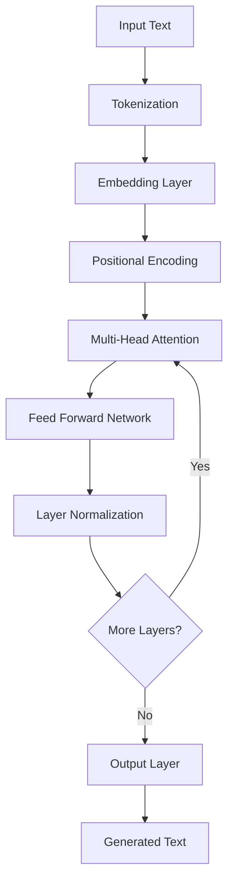

### 1. **Embedding Layer**
- Converts tokens (words/subwords) into dense vectors (numbers)
- Each token becomes a point in high-dimensional space
- Similar words are closer together in this space

**Example:**
```
"cat" → [0.2, -0.5, 0.8, ..., 0.1]  (vector of 768 or more dimensions)
"dog" → [0.3, -0.4, 0.7, ..., 0.2]  (similar vector, close to "cat")
"airplane" → [-0.1, 0.9, -0.3, ..., -0.5]  (very different vector)
```

### 2. **Positional Encoding**
- Adds information about word position in the sentence
- Transformers don't inherently understand order, so we add position info

**Why it matters:**
```
"The cat sat on the mat" ≠ "The mat sat on the cat"
Position matters!
```

### 3. **Multi-Head Attention** (Most Important!)
- Allows the model to focus on different parts of the input simultaneously
- Each "head" looks at different relationships
- We'll dive deeper into this in Section 4

### 4. **Feed Forward Network**
- Two-layer neural network that processes each position independently
- Adds non-linearity and complexity to the model

### 5. **Layer Normalization**
- Stabilizes training and improves performance
- Normalizes the values to prevent them from growing too large

### Architecture Stack

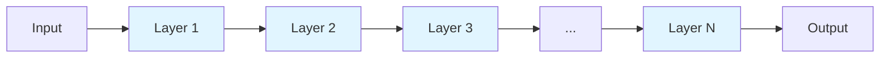

**GPT-3 has 96 layers!** Each layer refines the understanding.

---

## 3. Tokenization: Converting Text to Numbers

### What is Tokenization?

LLMs don't understand words directly. They work with **tokens** - numerical representations of text chunks.

### Types of Tokenization

#### 1. **Word-Level Tokenization**
```
"Hello world" → ["Hello", "world"]
```
- Simple but creates huge vocabularies
- Can't handle unknown words

#### 2. **Subword Tokenization** (Used by GPT, BERT)
```
"unhappiness" → ["un", "happiness"]
"playing" → ["play", "ing"]
```

**Benefits:**
- Handles unknown words by breaking them into known parts
- More efficient vocabulary
- Better for different languages

#### 3. **Character-Level Tokenization**
```
"Hello" → ["H", "e", "l", "l", "o"]
```
- Very small vocabulary but loses word meaning

### BPE (Byte Pair Encoding) - Used by GPT

**How it works:**
1. Start with individual characters
2. Find most frequent pair of tokens
3. Merge them into a new token
4. Repeat until desired vocabulary size

**Example:**
```
Initial: "low" → ["l", "o", "w"]
After training: "low" → ["low"] (common word, single token)
"lower" → ["low", "er"] (common pattern)
```

### Token to Number Conversion

```python
# Simplified example
text = "Show me students"
tokens = tokenizer.encode(text)
# Result: [1234, 567, 8901]  (each token is a number)

# The model processes these numbers
```

### Real Example from Your System

When a user asks: **"Show me all students enrolled in 2024"**

```
Step 1: Tokenization
"Show me all students enrolled in 2024"
  ↓
Tokens: [1234, 567, 890, 12345, 6789, 12, 2024]

Step 2: Embedding
Each token → vector of 768+ dimensions

Step 3: Processing through transformer layers
```

---

## 4. Attention Mechanism: The Core Innovation

### What is Attention?

**Attention** allows the model to focus on relevant parts of the input when generating each word. It's like highlighting important words in a sentence.

### Simple Analogy

When you read: **"The cat sat on the mat because it was tired"**

You know "it" refers to "cat" because you pay **attention** to the context. LLMs do the same!

### Self-Attention Mechanism

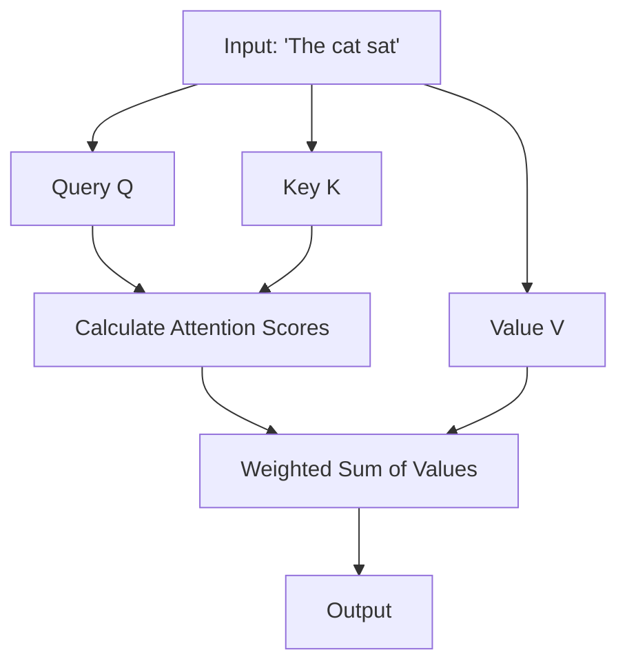

### How Attention Scores Work

For the sentence: **"The cat sat on the mat"**

When processing "cat", the model calculates:

```
Attention("cat" to "The") = 0.1   (low - article)
Attention("cat" to "cat") = 1.0   (high - itself)
Attention("cat" to "sat") = 0.8   (high - verb related to cat)
Attention("cat" to "on") = 0.2    (low - preposition)
Attention("cat" to "the") = 0.1   (low - article)
Attention("cat" to "mat") = 0.3   (medium - object)
```

The model learns these weights during training!

### Multi-Head Attention

Instead of one attention mechanism, transformers use **multiple heads** (typically 12-128), each looking at different relationships:

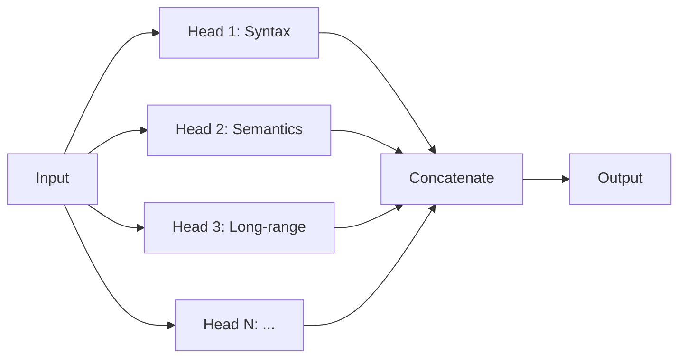

**Example:**
- **Head 1** might focus on grammatical relationships (subject-verb)
- **Head 2** might focus on meaning (cat → animal)
- **Head 3** might focus on long-distance dependencies

### Why Attention is Powerful

1. **Parallel Processing**: Can process all words simultaneously (unlike RNNs)
2. **Long-range Dependencies**: Can connect words far apart in the sentence
3. **Interpretability**: We can see what the model is "paying attention to"

### Visual Example

```
Query: "Show me students enrolled in 2024"

Attention weights when generating "students":
┌─────────┬──────────┬─────────┬─────────┬─────────┐
│  Show   │   me     │ students│ enrolled│   2024  │
├─────────┼──────────┼─────────┼─────────┼─────────┤
│   0.1   │   0.2    │   1.0   │   0.8   │   0.3   │
└─────────┴──────────┴─────────┴─────────┴─────────┘
         ↑                    ↑
    Low attention        High attention
```

---

## 5. Training LLMs: Pre-training and Fine-tuning

### Two-Stage Training Process

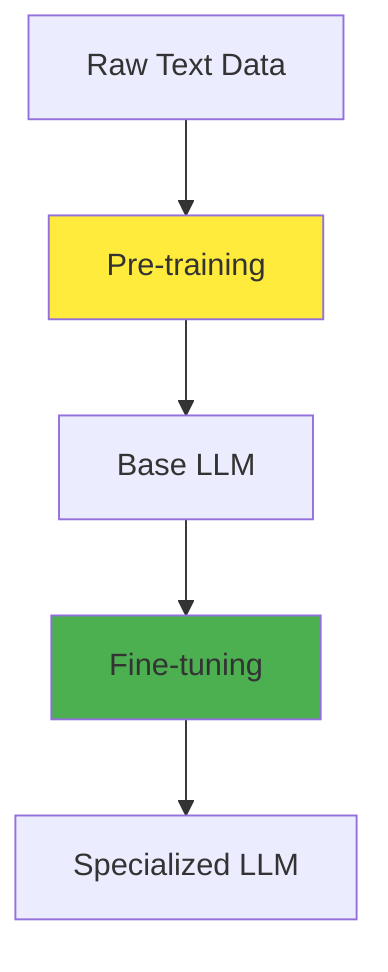

### Stage 1: Pre-training (The Foundation)

**Goal**: Learn general language patterns, grammar, facts, reasoning

**Process:**
1. **Data Collection**: Gather massive text corpus (entire internet, books, code, etc.)
   - GPT-3: ~500 billion tokens
   - Your training data: Petabytes of text

2. **Task**: Next Token Prediction (Autoregressive)
   ```
   Input: "The cat sat on the"
   Predict: "mat" (most likely next word)
   ```

3. **Training Process**:
   ```python
   # Simplified training loop
   for text in training_data:
       tokens = tokenize(text)
       for i in range(len(tokens)):
           # Predict next token
           prediction = model(tokens[:i])
           loss = compare(prediction, tokens[i])
           update_weights(loss)
   ```

4. **What the Model Learns**:
   - Grammar and syntax
   - Word relationships
   - Common facts
   - Reasoning patterns
   - Context understanding

**Cost**: Millions of dollars in compute (GPUs, time, electricity)

### Stage 2: Fine-tuning (Specialization)

**Goal**: Adapt the model for specific tasks

**Types of Fine-tuning:**

#### A. **Supervised Fine-tuning (SFT)**
- Train on labeled examples
- Example: Question-answer pairs

```
Input: "What is SQL?"
Output: "SQL is a programming language for databases..."
```

#### B. **Reinforcement Learning from Human Feedback (RLHF)**
- Used by ChatGPT
- Humans rate responses
- Model learns to generate preferred responses

#### C. **Instruction Tuning**
- Train on instruction-following examples
- Makes the model better at following prompts

### Training Your NL2SQL Model

In your system, you're using:
- **Base Model**: GPT-4 (pre-trained by OpenAI)
- **Fine-tuning**: System prompts + few-shot examples
- **In-context Learning**: Providing examples in the prompt

```python
# From your code (llm/utils.py)
SQL_PREFIX = f"""You are AI Assist for Analytics...
    ## Instructions for SQL Query Generation:
    1. Generate a syntactically correct SQL query...
    2. Execute the query using the available tools...
    ...
"""
```

This is **prompt engineering** - a form of in-context fine-tuning!

---

## 6. How LLMs Generate Text

### The Generation Process

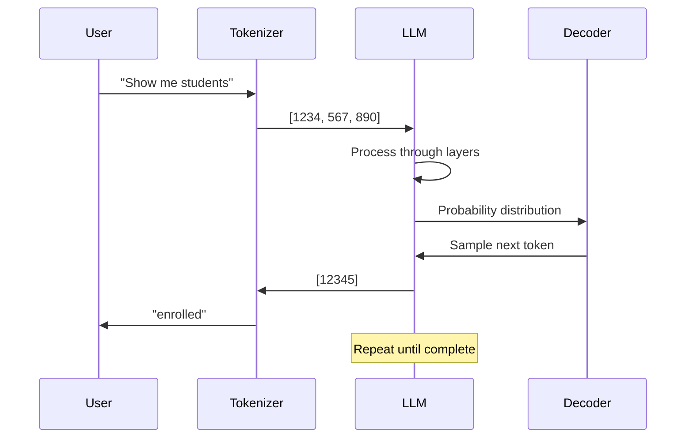

### Step-by-Step Generation

#### Step 1: Input Processing
```
User: "Show me students"
  ↓ Tokenization
Tokens: [1234, 567, 890]
  ↓ Embedding
Vectors: [[0.1, 0.2, ...], [0.3, 0.1, ...], ...]
  ↓ Transformer Layers (96 layers in GPT-3)
Refined understanding at each layer
```

#### Step 2: Next Token Prediction
After processing input, the model outputs a **probability distribution** over all possible tokens:

```
Token          Probability
─────────────────────────────
"enrolled"     0.35  ← Most likely
"in"           0.25
"with"         0.15
"from"         0.10
"for"          0.08
...            ...
```

#### Step 3: Sampling Strategy

**Greedy Decoding** (always pick highest probability):
```
Always pick: "enrolled" (0.35)
```

**Temperature Sampling** (adds randomness):
```python
temperature = 0.7  # Lower = more deterministic
# Higher temperature = more creative/random
```

**Top-k Sampling** (consider only top k options):
```python
top_k = 50  # Only consider top 50 most likely tokens
```

**Top-p (Nucleus) Sampling** (consider tokens until cumulative probability reaches p):
```python
top_p = 0.9  # Consider tokens until 90% probability mass
```

#### Step 4: Iterative Generation

```
Input: "Show me students"
  ↓
Generate: "enrolled"
  ↓
Input: "Show me students enrolled"
  ↓
Generate: "in"
  ↓
Input: "Show me students enrolled in"
  ↓
Generate: "2024"
  ↓
Complete: "Show me students enrolled in 2024"
```

### Why This Works

The model has seen millions of similar patterns:
- "Show me X enrolled in Y"
- "List students in year Z"
- "Get all X from Y"

It learns these patterns and applies them!

### Generation in Your NL2SQL System

```python
# Simplified version of what happens
question = "Show me all students enrolled in 2024"

# 1. Intent Classification
intent = determine_intent(question)  # Returns: "sql"

# 2. Hybrid Search (find relevant tables)
tables, metadata = hybrid_search(question)

# 3. LLM generates SQL
prompt = f"""
System: {SQL_PREFIX}
User: {question}
Context: {metadata}
"""

sql_query = llm.generate(prompt)
# Result: "SELECT * FROM students WHERE enrollment_year = 2024"
```

---

## 7. Why LLMs Succeed

### 1. **Scale: More is More**

**Parameter Count Growth:**
```
GPT-1 (2018):    117M parameters
GPT-2 (2019):    1.5B parameters
GPT-3 (2020):    175B parameters
GPT-4 (2023):    ~1.7T parameters (estimated)
```

**Emergent Abilities**: At certain scales, LLMs develop new capabilities:
- Few-shot learning
- Chain-of-thought reasoning
- Code generation
- Mathematical reasoning

### 2. **Massive Training Data**

```
GPT-3 Training Data:
- Common Crawl (web pages)
- Books
- Wikipedia
- Code repositories
- Scientific papers
- Total: ~500 billion tokens
```

**Diversity matters**: More diverse data = better generalization

### 3. **Architecture Advantages**

**Transformers excel at:**
- **Parallelization**: Process all tokens simultaneously
- **Long Context**: Can handle very long sequences
- **Attention**: Focus on relevant information
- **Transfer Learning**: Pre-trained knowledge transfers to new tasks

### 4. **In-Context Learning**

LLMs can learn from examples in the prompt without retraining:

```
Example 1: "Translate to French: Hello → Bonjour"
Example 2: "Translate to French: Goodbye → Au revoir"
Query: "Translate to French: Thank you"
Model: "Merci" (learned the pattern!)
```

### 5. **Fine-tuning Flexibility**

Same base model can be adapted for:
- Code generation
- SQL generation
- Question answering
- Summarization
- Translation

### 6. **Reasoning Capabilities**

Modern LLMs can:
- Follow logical chains
- Understand context
- Make inferences
- Handle ambiguity

### Success Factors in Your NL2SQL System

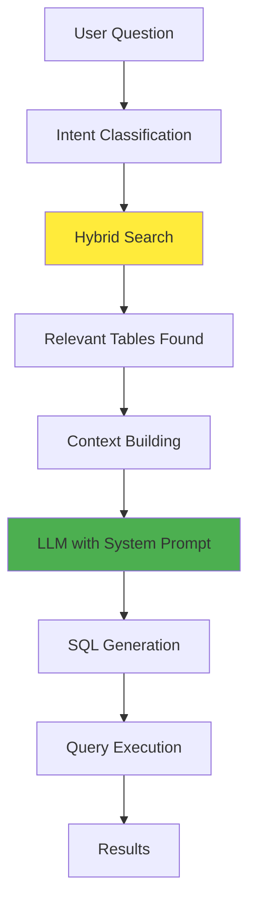

**Why it works:**
1. **Rich Context**: Hybrid search provides relevant schema information
2. **Structured Prompts**: Clear instructions guide the LLM
3. **Few-shot Examples**: Shows the model what good SQL looks like
4. **Tool Integration**: LLM can use tools (list tables, check schema, execute queries)

---

## 8. Why LLMs Fail

### 1. **Hallucination: Making Things Up**

**Problem**: LLMs generate plausible-sounding but incorrect information

**Example:**
```
User: "Show me students from Harvard enrolled in 2024"
LLM: SELECT * FROM students WHERE university = 'Harvard' AND year = 2024
Reality: Your database doesn't have a 'university' column
```

**Why it happens:**
- Model learned patterns from training data
- Doesn't have access to actual database schema
- Generates based on what "sounds right"

**Your system's solution:**
```python
# From sql_agent.py - validates and re-executes
if 'sql_db_query' not in execution_tool_names or \
    len(sql_query.strip()) == 0 or \
    is_intent_negative(final_ai_response):
    # Handle failure case
```

### 2. **Context Window Limitations**

**Problem**: LLMs have maximum input length

```
GPT-3.5: 4,096 tokens (~3,000 words)
GPT-4:   8,192 tokens (~6,000 words)
GPT-4 Turbo: 128,000 tokens (~96,000 words)
```

**Impact**: Can't process very long documents or many tables at once

**Your system's solution:**
- Hybrid search finds only relevant tables (reduces context)
- Focuses on top 2-5 most relevant tables

### 3. **Lack of Real-World Knowledge**

**Problem**: Training data has a cutoff date

```
GPT-4 Training: Data up to April 2023
Current Date: 2024
Missing: Events, facts, data after cutoff
```

**Impact**: Can't answer questions about recent events

### 4. **Ambiguity Handling**

**Problem**: Natural language is ambiguous

```
User: "Show me active students"
Ambiguity:
- Currently enrolled?
- Recently active?
- Active in system?
- Active status flag?
```

**Your system's solution:**
- Clarifying questions
- Semantic phrase matching
- Entity metadata to understand domain

### 5. **Token Limits and Cost**

**Problem**: 
- Longer prompts = more tokens = higher cost
- Rate limits from API providers
- Latency increases with context size

**Your system's optimization:**
```python
# Limit results to 5 rows (from utils.py)
"Always limit results to a maximum of 5 rows unless the user requests a different number."
```

### 6. **Schema Mismatch**

**Problem**: LLM assumes schema that doesn't exist

```
LLM thinks: "students" table has "name", "age", "gpa"
Reality: Table is "student_records" with "full_name", "date_of_birth", "grade_point_avg"
```

**Your system's solution:**
- Hybrid search provides actual schema
- Metadata includes column descriptions
- System prompt includes exact table/column names

### 7. **Complex Queries**

**Problem**: Multi-step reasoning can fail

```
User: "Show me students who enrolled in 2024 and have GPA > 3.5, 
       but exclude those who dropped out"
       
Requires:
1. Filter by enrollment year
2. Filter by GPA
3. Join with dropout records
4. Exclude matches
```

**Why it fails:**
- Multiple conditions
- Requires joins
- Complex logic

**Mitigation**: Break into simpler queries or use agentic approach (ReAct)

### 8. **Security and Injection**

**Problem**: SQL injection if not careful

```
User: "Delete all students"  # Should be blocked!
```

**Your system's protection:**
```python
# From utils.py
"NEVER perform DML operations (INSERT, UPDATE, DELETE, DROP, etc.)."
```

### Common Failure Patterns in NL2SQL

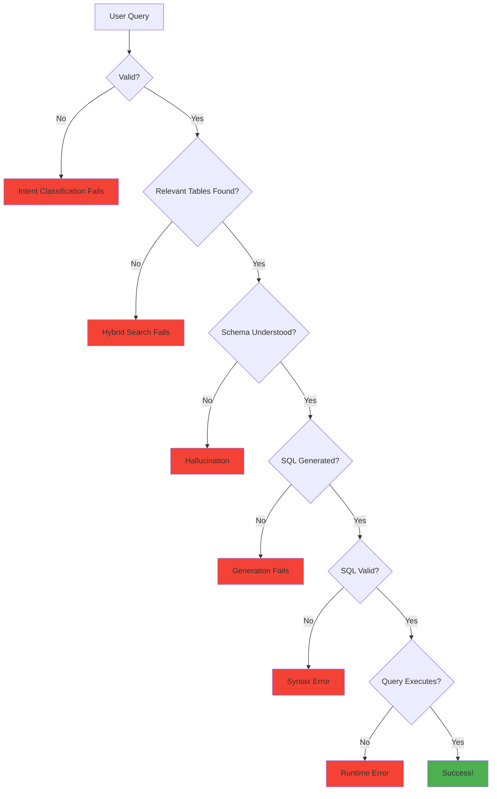

---

## 9. NL2SQL: Natural Language to SQL

### What is NL2SQL?

**NL2SQL** (Natural Language to SQL) converts human questions into SQL queries.

**Example:**
```
Input:  "Show me all students enrolled in 2024"
Output: SELECT * FROM students WHERE enrollment_year = 2024
```

### Why NL2SQL is Challenging

1. **Language Ambiguity**: Same question, multiple SQL interpretations
2. **Schema Complexity**: Large databases with many tables
3. **Domain Knowledge**: Need to understand business context
4. **SQL Expertise**: Must generate syntactically correct SQL

### Approaches to NL2SQL

#### 1. **Rule-Based** (Old approach)
```
If question contains "how many" → Use COUNT()
If question contains "list" → Use SELECT
...
```
**Limitation**: Doesn't scale, brittle

#### 2. **Machine Learning** (Traditional)
- Train classifier to identify intent
- Use sequence-to-sequence models
- **Limitation**: Requires labeled training data

#### 3. **LLM-Based** (Modern - Your approach!)
- Use pre-trained LLMs
- Provide schema context
- Generate SQL directly
- **Advantage**: No training needed, works out of the box

### NL2SQL Pipeline

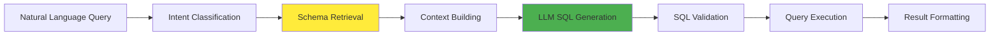

### Key Components

#### 1. **Intent Classification**
Determine if query needs SQL or documentation:

```python
# From intent.py
"Show me students" → "sql" (confidence: 0.99)
"How do I enroll?" → "docs" (confidence: 0.95)
```

#### 2. **Schema Retrieval**
Find relevant tables and columns:

```python
# From embedding/utils.py - hybrid_search
query = "Show me students enrolled in 2024"
→ Finds: ["students", "enrollments"] tables
→ Provides: Table descriptions, column info, relationships
```

#### 3. **Context Building**
Combine schema info into prompt:

```python
context = f"""
Table: students
Description: Contains student records
Columns:
  - student_id: Unique identifier
  - enrollment_year: Year of enrollment
  - name: Student full name
...
"""
```

#### 4. **SQL Generation**
LLM generates SQL with context:

```python
prompt = f"""
System: {SQL_PREFIX}
Context: {context}
User: {question}
"""
sql = llm.generate(prompt)
```

#### 5. **Validation & Execution**
- Check SQL syntax
- Execute query
- Return results

---

## 10. Your NL2SQL System Architecture

### Complete System Flow

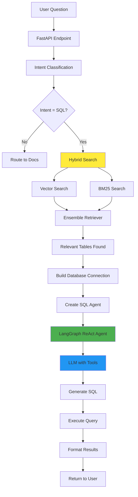

### Component Deep Dive

#### 1. **Intent Classification** (`llm/intent.py`)

```python
def determine_intent(question: str) -> RouteQuery:
    # Uses structured output from LLM
    # Few-shot examples guide classification
    # Returns: {"datasource": "sql"|"docs", "confidence": 0.0-1.0}
```

**Why it works:**
- Few-shot learning: Examples show the pattern
- Structured output: Guarantees valid response format
- High confidence threshold: Only routes when certain

#### 2. **Hybrid Search** (`embedding/utils.py`)

**Two-stage retrieval:**

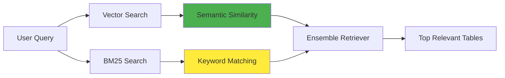

**Vector Search (Semantic):**
- Uses embeddings (text-embedding-3-large)
- Finds tables with similar meaning
- Example: "students" matches "student_records", "enrollments"

**BM25 Search (Keyword):**
- Traditional information retrieval
- Matches exact keywords
- Fast and reliable for exact matches

**Ensemble:**
```python
ensemble_retriever = EnsembleRetriever(
    retrievers=[vector_retriever, bm25_retriever],
    weights=[0.5, 0.5]  # Equal weight
)
```

**Why hybrid?**
- Vector: Handles synonyms, semantic similarity
- BM25: Handles exact matches, technical terms
- Together: Best of both worlds

#### 3. **SQL Agent** (`llm/sql_agent.py`)

**ReAct Pattern** (Reasoning + Acting):

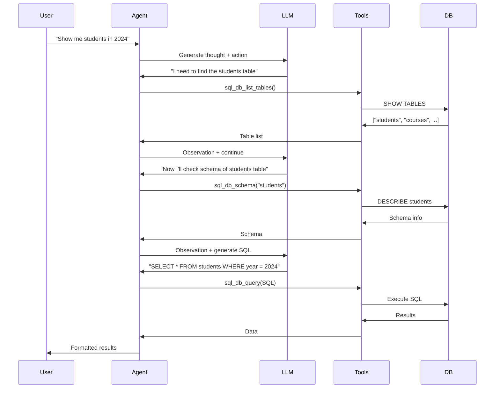

**Tools Available:**
1. `sql_db_list_tables`: List all tables
2. `sql_db_schema`: Get table schema
3. `sql_db_query`: Execute SQL query

**Why ReAct?**
- **Reasoning**: LLM explains its thought process
- **Acting**: Uses tools to gather information
- **Iterative**: Can refine based on observations

#### 4. **System Prompt** (`llm/utils.py`)

Your system prompt is comprehensive:

```python
SQL_PREFIX = f"""
You are AI Assist for Analytics...
## Instructions for SQL Query Generation:
1. Generate syntactically correct SQL
2. Execute using available tools
3. Return accurate results

### Query Construction Guidelines:
- Limit to 5 rows
- Only SELECT relevant columns
- Use tables from: {extract_tables}
- Check SQL correctness before executing
- NEVER perform DML operations

### Special Handling:
- "How many" → Use COUNT()
- Proper nouns → Use LIKE '%value%'
- Code fields → Use = (exact match)
...
"""
```

**Key Features:**
- **Clear instructions**: Step-by-step guidance
- **Constraints**: Prevents dangerous operations
- **Examples**: Shows correct patterns
- **Context**: Includes relevant tables and metadata

#### 5. **Structured Output**

```python
structured_response_format = {
    "type": "object",
    "properties": {
        "columns": {"type": "array"},
        "data": {"type": "array"},
        "title": {"type": "string"},
        "short_description": {"type": "string"}
    }
}
```

**Benefits:**
- Guaranteed format
- Easy to parse
- Consistent responses

### Data Flow Example

**User Query**: "Show me all students enrolled in 2024"

**Step 1: Intent Classification**
```python
determine_intent("Show me all students enrolled in 2024")
→ {"datasource": "sql", "confidence": 0.99}
```

**Step 2: Hybrid Search**
```python
hybrid_search("Show me all students enrolled in 2024")
→ Tables: ["students", "enrollments"]
→ Metadata: "students table contains student records..."
→ Entity: "Student Information System"
```

**Step 3: Database Connection**
```python
db = get_database(["students", "enrollments"])
# Creates connection to Databricks with only relevant tables
```

**Step 4: Agent Execution**
```python
agent = create_react_agent(llm, toolkit.get_tools())
response = agent.invoke({
    "messages": [HumanMessage(content=question)]
})
```

**Step 5: SQL Generation** (Inside agent)
```
Thought: "I need to find students enrolled in 2024"
Action: sql_db_schema("students")
Observation: "Table has columns: student_id, name, enrollment_year..."
Thought: "I'll query students where enrollment_year = 2024"
Action: sql_db_query("SELECT * FROM students WHERE enrollment_year = 2024")
Observation: [Results...]
```

**Step 6: Result Formatting**
```python
{
    "columns": ["student_id", "name", "enrollment_year"],
    "data": [[1, "John Doe", 2024], [2, "Jane Smith", 2024]],
    "title": "Students Enrolled in 2024",
    "short_description": "List of all students enrolled in 2024"
}
```

---

## 11. Practical Examples and Case Studies

### Example 1: Simple Query

**User Input:**
```
"Show me all students enrolled in 2024"
```

**Processing:**
1. **Intent**: SQL (confidence: 0.99)
2. **Hybrid Search**: Finds "students" table
3. **Context Built**:
   ```
   Table: students
   Columns: student_id, name, enrollment_year, ...
   ```
4. **SQL Generated**:
   ```sql
   SELECT student_id, name, enrollment_year 
   FROM students 
   WHERE enrollment_year = 2024 
   LIMIT 5
   ```
5. **Result**: List of students

### Example 2: Complex Query with Join

**User Input:**
```
"Show me students with GPA above 3.5 who are enrolled in Computer Science"
```

**Processing:**
1. **Intent**: SQL (confidence: 0.98)
2. **Hybrid Search**: Finds ["students", "enrollments", "courses"]
3. **Context Built**: Multiple tables with relationships
4. **SQL Generated**:
   ```sql
   SELECT s.student_id, s.name, s.gpa, c.course_name
   FROM students s
   JOIN enrollments e ON s.student_id = e.student_id
   JOIN courses c ON e.course_id = c.course_id
   WHERE s.gpa > 3.5 
     AND LOWER(c.course_name) LIKE '%computer science%'
   LIMIT 5
   ```
5. **Result**: Filtered and joined data

### Example 3: Count Query

**User Input:**
```
"How many students are enrolled in 2024?"
```

**Processing:**
1. **Intent**: SQL (confidence: 0.99)
2. **System Prompt**: Recognizes "How many" → Use COUNT()
3. **SQL Generated**:
   ```sql
   SELECT COUNT(*) 
   FROM students 
   WHERE enrollment_year = 2024
   ```
4. **Result**: Single number (count)

### Example 4: Failure Case - Ambiguity

**User Input:**
```
"Show me active students"
```

**Potential Issues:**
- What does "active" mean?
- Currently enrolled?
- Recently logged in?
- Active status flag?

**Your System's Handling:**
1. **Semantic Matching**: Checks for "active students" in key phrases
2. **Clarifying Question**: If ambiguous, asks for clarification
3. **Default Behavior**: Uses most common interpretation (currently enrolled)

### Example 5: Failure Case - Schema Mismatch

**User Input:**
```
"Show me students from Harvard"
```

**Problem:**
- Database doesn't have "university" or "school" column
- LLM might hallucinate column name

**Your System's Protection:**
1. **Hybrid Search**: Only provides actual schema
2. **System Prompt**: "Only use tables from: {extract_tables}"
3. **Tool Usage**: Agent checks actual schema before generating SQL
4. **Validation**: SQL execution fails if column doesn't exist → retry

### Real-World Performance

**Success Rate Factors:**
- **Simple queries**: 90-95% success
- **Complex queries with joins**: 70-80% success
- **Ambiguous queries**: 50-60% (needs clarification)

**Improvement Strategies:**
1. **Better Metadata**: More detailed table/column descriptions
2. **More Examples**: Few-shot examples in prompt
3. **Clarifying Questions**: Ask when ambiguous
4. **Error Recovery**: Retry with different approach on failure

---

## Summary: Key Takeaways

### How LLMs Work
1. **Transformers**: Multi-layer neural networks with attention
2. **Tokenization**: Convert text to numbers
3. **Attention**: Focus on relevant parts of input
4. **Training**: Pre-training on massive data + fine-tuning
5. **Generation**: Predict next token iteratively

### Why They Succeed
- **Scale**: Billions of parameters
- **Data**: Massive training corpora
- **Architecture**: Efficient and parallelizable
- **Flexibility**: One model, many tasks

### Why They Fail
- **Hallucination**: Make up information
- **Context Limits**: Can't process everything
- **Ambiguity**: Misinterpret unclear queries
- **Schema Mismatch**: Assume wrong structure

### Your NL2SQL System
- **Hybrid Search**: Combines semantic + keyword search
- **ReAct Agent**: Reasoning + tool usage
- **Rich Context**: Schema + metadata + examples
- **Validation**: Multiple checks prevent errors

### Best Practices
1. **Provide Context**: Give LLM relevant schema information
2. **Clear Instructions**: Explicit guidelines in prompts
3. **Validation**: Check outputs before execution
4. **Error Handling**: Graceful failure and retry
5. **User Feedback**: Clarify ambiguous queries

---

## Further Learning Resources

### Papers to Read
1. **"Attention Is All You Need"** (2017) - Transformer architecture
2. **"Language Models are Few-Shot Learners"** (2020) - GPT-3 paper
3. **"Training language models to follow instructions"** (2022) - InstructGPT

### Online Courses
- **CS224N** (Stanford): Natural Language Processing
- **Fast.ai**: Practical Deep Learning
- **Hugging Face Course**: Transformers

### Tools to Experiment
- **Hugging Face**: Pre-trained models
- **LangChain**: LLM application framework
- **OpenAI Playground**: Test prompts
- **Local LLMs**: Ollama, LM Studio

---

**End of Learning Guide**

*This guide provides a comprehensive foundation for understanding LLMs and your NL2SQL system. Study each section, experiment with the concepts, and you'll be ready to present with confidence!*

