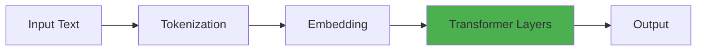
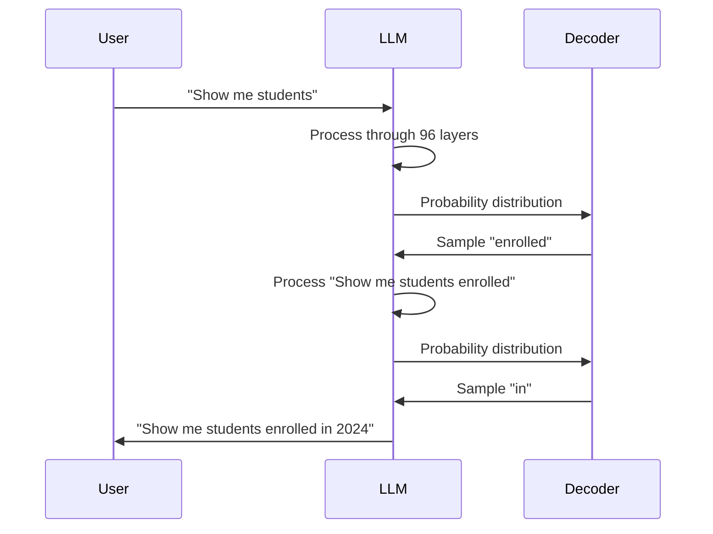
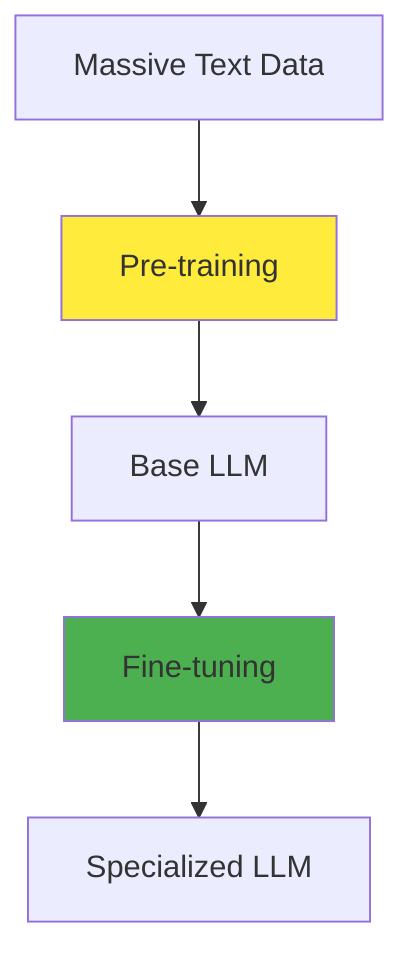
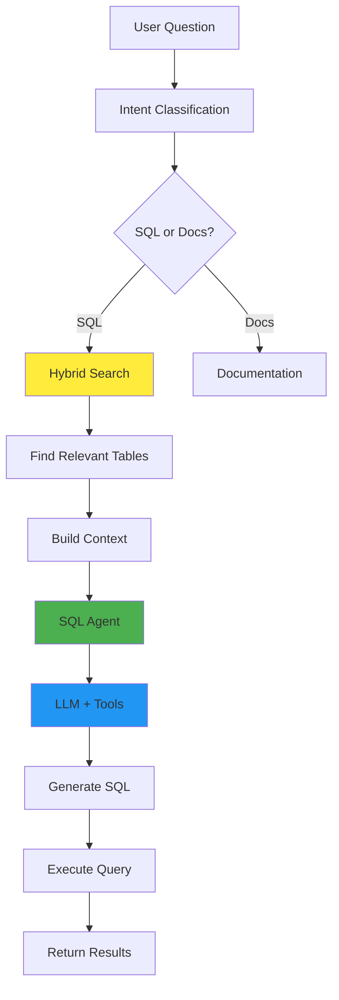
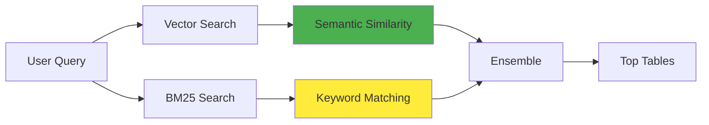
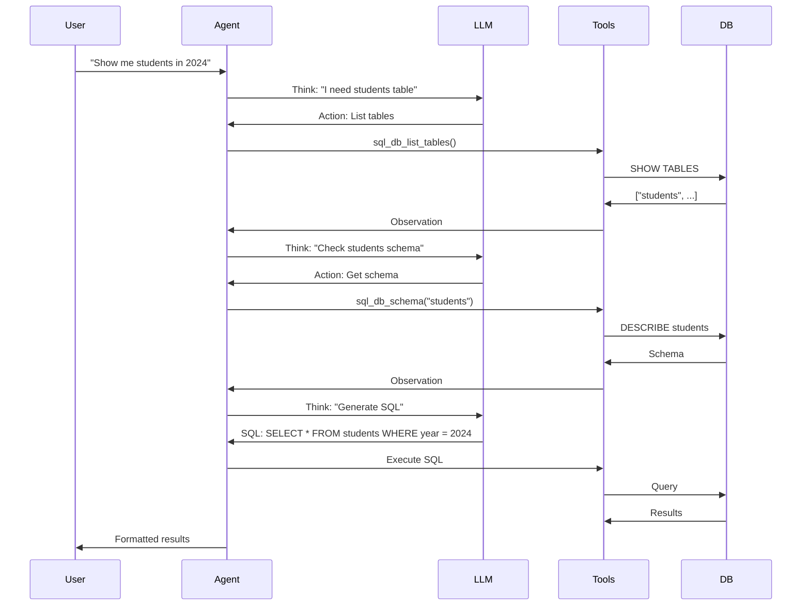
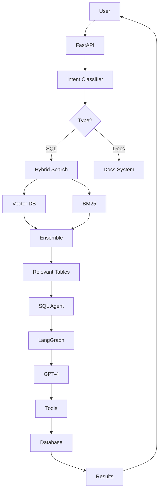

# Behind the Scenes of LLMs: How AI Turns English into SQL

**10-15 Minute Presentation**

---

## Slide 1: Title Slide

# Behind the Scenes of LLMs
## How AI Turns English into SQL

**Presented by:** [Your Name]  
**Date:** [Date]  
**Project:** NL2SQL

---

## Slide 2: The Problem We're Solving

### The Challenge

**Before LLMs:**
```
User: "Show me all students enrolled in 2024"
Developer: Writes SQL manually
  ↓
SELECT * FROM students WHERE enrollment_year = 2024
```

**With LLMs:**
```
User: "Show me all students enrolled in 2024"
AI: Automatically generates SQL
  ↓
SELECT * FROM students WHERE enrollment_year = 2024
```

**Impact:**
- Non-technical users can query databases
- Faster development
- Natural language interface

---

## Slide 3: What is an LLM?

### Large Language Model (LLM)

**Definition:**
A neural network trained on massive text data to understand and generate human-like text.

**Key Numbers:**
- **GPT-3**: 175 billion parameters
- **GPT-4**: ~1.7 trillion parameters (estimated)
- **Training Data**: 500+ billion tokens (entire internet, books, code)

**Analogy:**
Think of an LLM as a **super librarian** who:
- Has read every book in the world
- Remembers patterns and relationships
- Can predict what comes next
- Understands context

---

## Slide 4: The Transformer Architecture

### How LLMs Process Text



**Core Components:**
1. **Tokenization**: Convert text to numbers
2. **Embeddings**: Convert tokens to vectors
3. **Attention**: Focus on relevant parts
4. **Layers**: 96+ layers of processing (GPT-3)

**Key Innovation:**
- **Parallel Processing**: All words processed simultaneously
- **Attention Mechanism**: Understands relationships between words

---

## Slide 5: Tokenization - Converting Words to Numbers

### How LLMs See Text

**We see:**
```
"Show me students"
```

**LLM sees:**
```
[1234, 567, 8901]
```

**Process:**
1. Text → Split into tokens (words/subwords)
2. Tokens → Convert to numbers
3. Numbers → Process through neural network

**Example:**
```
"unhappiness" → ["un", "happiness"]  (subword tokens)
"playing" → ["play", "ing"]
```

**Why subwords?**
- Handles unknown words
- More efficient vocabulary
- Better for different languages

---

## Slide 6: Attention Mechanism - The Magic

### How LLMs Understand Context

**The Problem:**
```
"The cat sat on the mat because it was tired"
                    ↑
            What does "it" refer to?
```

**The Solution: Attention**

When processing "it", the model calculates attention scores:

```
Attention("it" to "cat") = 0.9  ← High! (refers to cat)
Attention("it" to "mat") = 0.1  ← Low
Attention("it" to "sat") = 0.2
```

**Visual Representation:**
```
Query: "Show me students enrolled in 2024"

Attention when generating "students":
┌─────────┬──────────┬─────────┬─────────┬─────────┐
│  Show   │   me     │ students│ enrolled│   2024  │
├─────────┼──────────┼─────────┼─────────┼─────────┤
│   0.1   │   0.2    │   1.0   │   0.8   │   0.3   │
└─────────┴──────────┴─────────┴─────────┴─────────┘
```

**Multi-Head Attention:**
- Multiple "heads" look at different relationships
- Head 1: Grammar (subject-verb)
- Head 2: Meaning (cat → animal)
- Head 3: Long-range dependencies

---

## Slide 7: How LLMs Generate Text

### The Generation Process



**Step-by-Step:**
1. **Input Processing**: Tokenize and embed
2. **Layer Processing**: 96 transformer layers refine understanding
3. **Next Token Prediction**: Output probability for each possible token
4. **Sampling**: Choose next token (with some randomness)
5. **Iterate**: Repeat until complete

**Example Probability Distribution:**
```
Token          Probability
─────────────────────────────
"enrolled"     0.35  ← Most likely
"in"           0.25
"with"         0.15
"from"         0.10
```

---

## Slide 8: Training LLMs - Two Stages

### How LLMs Learn



**Stage 1: Pre-training**
- **Data**: Entire internet, books, code (500B+ tokens)
- **Task**: Predict next word
- **Cost**: Millions of dollars, weeks of compute
- **Result**: General language understanding

**Stage 2: Fine-tuning**
- **Data**: Task-specific examples
- **Task**: Adapt for specific use case
- **Result**: Specialized model (e.g., SQL generation)

**Your System:**
- Uses **GPT-4** (pre-trained by OpenAI)
- **Prompt Engineering**: Provides examples and instructions
- **In-Context Learning**: Learns from examples in the prompt

---

## Slide 9: Why LLMs Succeed

### The Success Factors

**1. Scale Matters**
```
GPT-1:  117M parameters
GPT-2:  1.5B parameters
GPT-3:  175B parameters
GPT-4:  ~1.7T parameters
```
More parameters = Better performance

**2. Massive Training Data**
- Entire internet
- Books, articles, code
- Diverse sources = Better generalization

**3. Architecture Advantages**
- **Parallelization**: Process all tokens at once
- **Attention**: Understand long-range dependencies
- **Transfer Learning**: One model, many tasks

**4. In-Context Learning**
- Learns from examples in the prompt
- No retraining needed
- Adapts quickly to new tasks

---

## Slide 10: Why LLMs Fail

### Common Failure Modes

**1. Hallucination**
```
User: "Show me students from Harvard"
LLM: SELECT * FROM students WHERE university = 'Harvard'
Reality: No 'university' column exists!
```
→ Model makes up plausible-sounding but incorrect information

**2. Context Limits**
- GPT-4: 8,192 tokens (~6,000 words)
- Can't process very long documents
- **Solution**: Hybrid search finds only relevant parts

**3. Ambiguity**
```
"Show me active students"
→ Currently enrolled?
→ Recently active?
→ Active status flag?
```
→ Multiple interpretations possible

**4. Schema Mismatch**
- Assumes schema that doesn't exist
- **Solution**: Provide actual schema via tools

---

## Slide 11: NL2SQL - The Challenge

### Converting Natural Language to SQL

**The Problem:**
```
Input:  "Show me all students enrolled in 2024"
Output: SELECT * FROM students WHERE enrollment_year = 2024
```

**Why It's Hard:**
1. **Language Ambiguity**: Same question, multiple SQL interpretations
2. **Schema Complexity**: Large databases with many tables
3. **Domain Knowledge**: Need to understand business context
4. **SQL Expertise**: Must generate syntactically correct SQL

**Traditional Approach:**
- Rule-based systems (brittle)
- Machine learning (needs labeled data)

**Modern Approach (Yours):**
- **LLM-based**: Pre-trained model + context
- **No training needed**: Works out of the box
- **Flexible**: Handles various query types

---

## Slide 12: Your NL2SQL System Architecture

### Complete Flow



**Key Components:**
1. **Intent Classification**: Route to SQL or docs
2. **Hybrid Search**: Find relevant tables
3. **SQL Agent**: ReAct pattern (Reasoning + Acting)
4. **LLM + Tools**: Generate and execute SQL

---

## Slide 13: Hybrid Search - Finding Relevant Tables

### Two-Stage Retrieval



**Vector Search (Semantic):**
- Uses embeddings (text-embedding-3-large)
- Finds tables with similar meaning
- Example: "students" → matches "student_records", "enrollments"

**BM25 Search (Keyword):**
- Traditional information retrieval
- Matches exact keywords
- Fast and reliable

**Why Hybrid?**
- **Vector**: Handles synonyms, semantic similarity
- **BM25**: Handles exact matches, technical terms
- **Together**: Best of both worlds!

**Result:**
- Finds top 2-5 most relevant tables
- Provides schema and metadata
- Reduces context size (important for LLM limits)

---

## Slide 14: SQL Agent - ReAct Pattern

### Reasoning + Acting



**ReAct = Reasoning + Acting**
- **Reasoning**: LLM explains its thought process
- **Acting**: Uses tools to gather information
- **Iterative**: Can refine based on observations

**Tools Available:**
1. `sql_db_list_tables`: List all tables
2. `sql_db_schema`: Get table schema
3. `sql_db_query`: Execute SQL query

**Benefits:**
- Self-correcting: Can retry if query fails
- Transparent: Shows reasoning process
- Reliable: Validates before execution

---

## Slide 15: System Prompt - Guiding the LLM

### How We Control LLM Behavior

**Your System Prompt Includes:**

```python
SQL_PREFIX = """
You are AI Assist for Analytics...

## Instructions:
1. Generate syntactically correct SQL
2. Execute using available tools
3. Return accurate results

### Guidelines:
- Limit to 5 rows
- Only SELECT relevant columns
- Use tables from: {extract_tables}
- Check SQL correctness before executing
- NEVER perform DML operations (INSERT, UPDATE, DELETE)

### Special Handling:
- "How many" → Use COUNT()
- Proper nouns → Use LIKE '%value%'
- Code fields → Use = (exact match)
...
"""
```

**Key Features:**
- **Clear Instructions**: Step-by-step guidance
- **Constraints**: Prevents dangerous operations
- **Examples**: Shows correct patterns
- **Context**: Includes relevant tables and metadata

**Why It Works:**
- LLMs are instruction-following
- Clear prompts = Better results
- Constraints prevent errors

---

## Slide 16: Complete Example Walkthrough

### Real-World Flow

**User Query:**
```
"Show me all students enrolled in 2024"
```

**Step 1: Intent Classification**
```python
determine_intent("Show me all students enrolled in 2024")
→ {"datasource": "sql", "confidence": 0.99}
```

**Step 2: Hybrid Search**
```python
hybrid_search("Show me all students enrolled in 2024")
→ Tables: ["students", "enrollments"]
→ Metadata: "students table contains student records..."
```

**Step 3: SQL Agent Execution**
```
Thought: "I need to find students enrolled in 2024"
Action: sql_db_schema("students")
Observation: "Table has: student_id, name, enrollment_year..."
Thought: "I'll query where enrollment_year = 2024"
Action: sql_db_query("SELECT * FROM students WHERE enrollment_year = 2024")
Observation: [Results...]
```

**Step 4: Result**
```json
{
    "columns": ["student_id", "name", "enrollment_year"],
    "data": [
        [1, "John Doe", 2024],
        [2, "Jane Smith", 2024]
    ],
    "title": "Students Enrolled in 2024"
}
```

---

## Slide 17: Success vs Failure Cases

### When It Works vs When It Doesn't

**✅ Success Cases:**

1. **Simple Query**
   ```
   "Show me students in 2024"
   → SELECT * FROM students WHERE year = 2024
   Success Rate: 90-95%
   ```

2. **Count Query**
   ```
   "How many students enrolled in 2024?"
   → SELECT COUNT(*) FROM students WHERE year = 2024
   Success Rate: 95%+
   ```

3. **Complex Query**
   ```
   "Show me students with GPA > 3.5 in Computer Science"
   → JOIN + WHERE clauses
   Success Rate: 70-80%
   ```

**❌ Failure Cases:**

1. **Ambiguity**
   ```
   "Show me active students"
   → What does "active" mean?
   Solution: Ask clarifying question
   ```

2. **Schema Mismatch**
   ```
   "Show me students from Harvard"
   → No "university" column
   Solution: Tool validation catches this
   ```

3. **Complex Logic**
   ```
   Multi-step reasoning with multiple joins
   → Can fail on complex queries
   Solution: Break into simpler queries
   ```

---

## Slide 18: Key Takeaways

### What We Learned

**How LLMs Work:**
1. **Transformers**: Multi-layer neural networks with attention
2. **Tokenization**: Convert text to numbers
3. **Attention**: Focus on relevant parts
4. **Training**: Pre-training + fine-tuning
5. **Generation**: Predict next token iteratively

**Why They Succeed:**
- Scale (billions of parameters)
- Massive training data
- Efficient architecture
- Flexibility (one model, many tasks)

**Why They Fail:**
- Hallucination (make up information)
- Context limits
- Ambiguity
- Schema mismatch

**Your NL2SQL System:**
- Hybrid search finds relevant tables
- ReAct agent reasons and acts
- Rich context guides generation
- Validation prevents errors

---

## Slide 19: The Future

### What's Next?

**Current Limitations:**
- Context window limits
- Hallucination issues
- Cost and latency

**Emerging Solutions:**
- **Larger Context Windows**: 128K+ tokens
- **Better Fine-tuning**: More efficient training
- **Local LLMs**: Run on your own hardware
- **Specialized Models**: Domain-specific LLMs

**For NL2SQL:**
- Better schema understanding
- Multi-database support
- Query optimization
- Real-time learning from feedback

**The Big Picture:**
- LLMs are becoming more capable
- Integration with tools is improving
- Cost is decreasing
- **The future is bright!** 🚀

---

## Slide 20: Q&A

### Questions?

**Thank you for your attention!**

**Resources:**
- Learning Guide: `docs/LLM_Deep_Learning_Guide.md`
- Code Repository: [Your repo link]
- Questions: [Your contact]

---

## Appendix: Visual Diagrams for PowerPoint

### Diagram 1: Transformer Architecture (Detailed)

```mermaid
graph TD
    A[Input: "Show me students"] --> B[Tokenization]
    B --> C[Embedding Layer]
    C --> D[Positional Encoding]
    D --> E[Multi-Head Attention]
    E --> F[Feed Forward]
    F --> G[Layer Norm]
    G --> H{More Layers?}
    H -->|Yes| E
    H -->|No| I[Output Layer]
    I --> J[Next Token Prediction]
    J --> K["enrolled"]
```

### Diagram 2: Attention Visualization

```
Query: "Show me students enrolled in 2024"

When generating "students":
┌─────────┬──────────┬─────────┬─────────┬─────────┐
│  Show   │   me     │ students│ enrolled│   2024  │
├─────────┼──────────┼─────────┼─────────┼─────────┤
│   0.1   │   0.2    │   1.0   │   0.8   │   0.3   │
└─────────┴──────────┴─────────┴─────────┴─────────┘
    Low      Low      High      High      Medium
```

### Diagram 3: Complete System Architecture



---

## Presentation Tips

### Timing (10-15 minutes)

**Recommended Breakdown:**
- Slides 1-3: Introduction (2 min)
- Slides 4-8: How LLMs Work (4 min)
- Slides 9-10: Success/Failure (2 min)
- Slides 11-16: NL2SQL System (5 min)
- Slides 17-20: Examples & Conclusion (2 min)

### Delivery Tips

1. **Start with the problem**: Why NL2SQL matters
2. **Use analogies**: "Super librarian" for LLM
3. **Show visuals**: Diagrams help understanding
4. **Real examples**: Use your actual system examples
5. **Interactive**: Ask questions, engage audience
6. **Practice**: Know your flow, timing

### Visual Aids

- Use the mermaid diagrams (convert to images)
- Show actual code snippets from your system
- Demo the system live if possible
- Use color coding (green = success, red = failure)

---

**End of Presentation**

*Good luck with your presentation! You've got this!* 🎯

