# Before vs After LLMs - NL2SQL Comparison Diagrams

## Diagram 1: Before vs After LLMs - Side by Side Comparison

```mermaid
graph LR
    subgraph Before["❌ Before LLMs"]
        B1[User Query] --> B2["User: 'Show me all students<br/>enrolled in 2024'"]
        B2 --> B3[Developer]
        B3 --> B4[Manual SQL Writing]
        B4 --> B5["SELECT * FROM students<br/>WHERE enrollment_year = 2024"]
        B5 --> B6[Database]
        B6 --> B7[Results]
    end
    
    subgraph After["✅ With LLMs"]
        A1[User Query] --> A2["User: 'Show me all students<br/>enrolled in 2024'"]
        A2 --> A3[AI/LLM]
        A3 --> A4[Automatic SQL Generation]
        A4 --> A5["SELECT * FROM students<br/>WHERE enrollment_year = 2024"]
        A5 --> A6[Database]
        A6 --> A7[Results]
    end
    
    style Before fill:#ffebee
    style After fill:#e8f5e9
    style B3 fill:#ffcdd2
    style A3 fill:#c8e6c9
```

## Diagram 2: Complete Flow Comparison with Impact

```mermaid
graph TD
    subgraph BeforeFlow["🔴 Before LLMs - Manual Process"]
        BF1["👤 User:<br/>'Show me all students<br/>enrolled in 2024'"] --> BF2["👨‍💻 Developer"]
        BF2 --> BF3["✍️ Writes SQL manually<br/>(Requires SQL knowledge)"]
        BF3 --> BF4["📝 SQL Query:<br/>SELECT * FROM students<br/>WHERE enrollment_year = 2024"]
        BF4 --> BF5["💾 Database"]
        BF5 --> BF6["📊 Results"]
    end
    
    subgraph AfterFlow["🟢 With LLMs - Automated Process"]
        AF1["👤 User:<br/>'Show me all students<br/>enrolled in 2024'"] --> AF2["🤖 AI/LLM"]
        AF2 --> AF3["⚡ Automatically generates SQL<br/>(No SQL knowledge needed)"]
        AF3 --> AF4["📝 SQL Query:<br/>SELECT * FROM students<br/>WHERE enrollment_year = 2024"]
        AF4 --> AF5["💾 Database"]
        AF5 --> AF6["📊 Results"]
    end
    
    subgraph Impact["💡 Impact"]
        I1["✅ Non-technical users can query databases"]
        I2["✅ Faster development"]
        I3["✅ Natural language interface"]
    end
    
    AfterFlow --> Impact
    
    style BeforeFlow fill:#ffebee
    style AfterFlow fill:#e8f5e9
    style Impact fill:#e3f2fd
    style BF2 fill:#ffcdd2
    style AF2 fill:#c8e6c9
```

## Diagram 3: Process Comparison with Time and Effort

```mermaid
graph TB
    subgraph Before["❌ Before LLMs"]
        BQ["User Query:<br/>'Show me all students<br/>enrolled in 2024'"] --> BD["Developer"]
        BD --> BSQL["Manual SQL Writing<br/>⏱️ Time: 5-10 minutes<br/>💼 Requires: SQL expertise"]
        BSQL --> BDB["SQL Query:<br/>SELECT * FROM students<br/>WHERE enrollment_year = 2024"]
        BDB --> BR["Results"]
    end
    
    subgraph After["✅ With LLMs"]
        AQ["User Query:<br/>'Show me all students<br/>enrolled in 2024'"] --> AAI["AI/LLM"]
        AAI --> ASQL["Automatic SQL Generation<br/>⏱️ Time: < 1 second<br/>💼 Requires: None"]
        ASQL --> ADB["SQL Query:<br/>SELECT * FROM students<br/>WHERE enrollment_year = 2024"]
        ADB --> AR["Results"]
    end
    
    subgraph Benefits["🎯 Benefits"]
        B1["✅ Non-technical users<br/>can query databases"]
        B2["✅ Faster development<br/>(100x faster)"]
        B3["✅ Natural language<br/>interface"]
        B4["✅ No SQL knowledge<br/>required"]
    end
    
    After --> Benefits
    
    style Before fill:#ffebee
    style After fill:#e8f5e9
    style Benefits fill:#fff3e0
    style BD fill:#ffcdd2
    style AAI fill:#c8e6c9
```

## Diagram 4: Detailed Workflow Comparison

## Diagram 5: Visual Comparison with Impact Boxes

```mermaid
graph TD
    subgraph BeforeBox["❌ Before LLMs"]
        B1["👤 User Query"] --> B2["👨‍💻 Developer<br/>(SQL Expert Required)"]
        B2 --> B3["✍️ Manual SQL Writing<br/>⏱️ 5-10 minutes"]
        B3 --> B4["📝 SQL Output"]
    end
    
    subgraph AfterBox["✅ With LLMs"]
        A1["👤 User Query"] --> A2["🤖 AI/LLM<br/>(No Expertise Required)"]
        A2 --> A3["⚡ Auto SQL Generation<br/>⏱️ < 1 second"]
        A3 --> A4["📝 SQL Output"]
    end
    
    subgraph ImpactBox["💡 Impact"]
        direction TB
        I1["✅ Non-technical users<br/>can query databases"]
        I2["✅ Faster development<br/>(100x speedup)"]
        I3["✅ Natural language<br/>interface"]
    end
    
    BeforeBox --> ImpactBox
    AfterBox --> ImpactBox
    
    style BeforeBox fill:#ffebee
    style AfterBox fill:#e8f5e9
    style ImpactBox fill:#e3f2fd
    style B2 fill:#ffcdd2
    style A2 fill:#c8e6c9
```

## Diagram 6: Simple Before/After with Same Output

```mermaid
graph LR
    subgraph Input["📥 Input"]
        I["User: 'Show me all students<br/>enrolled in 2024'"]
    end
    
    subgraph Before["❌ Before LLMs"]
        B1[Developer] --> B2[Manual Writing]
        B2 --> B3["SELECT * FROM students<br/>WHERE enrollment_year = 2024"]
    end
    
    subgraph After["✅ With LLMs"]
        A1[AI/LLM] --> A2[Auto Generation]
        A2 --> A3["SELECT * FROM students<br/>WHERE enrollment_year = 2024"]
    end
    
    subgraph Output["📤 Output"]
        O["Same SQL Query<br/>Same Results"]
    end
    
    subgraph Impact["💡 Impact"]
        direction TB
        IM1["✅ Non-technical users"]
        IM2["✅ Faster development"]
        IM3["✅ Natural language"]
    end
    
    I --> Before
    I --> After
    Before --> O
    After --> O
    After --> Impact
    
    style Before fill:#ffebee
    style After fill:#e8f5e9
    style Impact fill:#fff3e0
    style Output fill:#e1f5ff
```

## Diagram 7: Complete Comparison with All Details

```mermaid
flowchart TD
    Start["👤 User Query:<br/>'Show me all students enrolled in 2024'"] 
    
    Start --> BeforePath["❌ Before LLMs Path"]
    Start --> AfterPath["✅ With LLMs Path"]
    
    BeforePath --> BDev["👨‍💻 Developer<br/>(SQL Expert)"]
    BDev --> BWrite["✍️ Writes SQL manually<br/>⏱️ Time: 5-10 min<br/>💼 Skill: Required"]
    BWrite --> BSQL["📝 SQL:<br/>SELECT * FROM students<br/>WHERE enrollment_year = 2024"]
    
    AfterPath --> AAI["🤖 AI/LLM<br/>(No Expert Needed)"]
    AAI --> AGen["⚡ Automatically generates SQL<br/>⏱️ Time: < 1 sec<br/>💼 Skill: None"]
    AGen --> ASQL["📝 SQL:<br/>SELECT * FROM students<br/>WHERE enrollment_year = 2024"]
    
    BSQL --> DB[("💾 Database")]
    ASQL --> DB
    DB --> Results["📊 Results"]
    
    AfterPath --> Impact["💡 Impact"]
    Impact --> I1["✅ Non-technical users<br/>can query databases"]
    Impact --> I2["✅ Faster development"]
    Impact --> I3["✅ Natural language interface"]
    
    style BeforePath fill:#ffebee
    style AfterPath fill:#e8f5e9
    style Impact fill:#e3f2fd
    style BDev fill:#ffcdd2
    style AAI fill:#c8e6c9
    style DB fill:#fff3e0
    style Results fill:#e1f5ff
```

## Usage

Copy any of these mermaid diagrams and use them in:
- HTML files with mermaid.js
- Markdown files
- Presentations
- Documentation

All diagrams are ready to use!

