# BPE (Byte Pair Encoding) Tokenization - Mermaid Diagrams

## Diagram 1: Complete BPE Process Flow


## Diagram 2: Step-by-Step BPE Merging Process

```mermaid
graph LR
    subgraph Step1["Step 1: Initial Characters"]
        A1["l o w </w>"]
        A2["l o w e r </w>"]
        A3["n e w e s t </w>"]
        A4["w i d e s t </w>"]
    end
    
    subgraph Step2["Step 2: Count Pairs"]
        B1["('l','o') = 2"]
        B2["('o','w') = 2 ⭐"]
        B3["('e','s') = 2"]
        B4["('s','t') = 2"]
    end
    
    subgraph Step3["Step 3: Merge ('o','w') → 'ow'"]
        C1["l ow </w>"]
        C2["l ow e r </w>"]
        C3["n e w e s t </w>"]
        C4["w i d e s t </w>"]
    end
    
    subgraph Step4["Step 4: Next Merges"]
        D1["('e','s') → 'es'"]
        D2["('es','t') → 'est'"]
    end
    
    subgraph Step5["Final Vocabulary"]
        E1["low"]
        E2["lower"]
        E3["newest"]
        E4["widest"]
        E5["est"]
        E6["ow"]
    end
    
    Step1 --> Step2
    Step2 --> Step3
    Step3 --> Step4
    Step4 --> Step5
    
    style Step2 fill:#fff3e0
    style Step3 fill:#e8f5e9
    style Step5 fill:#e1f5ff
```



## Diagram 3: BPE Training vs Tokenization

```mermaid
graph TB
    subgraph Training["🔵 Training Phase"]
        T1[Training Corpus] --> T2[Initialize with Characters]
        T2 --> T3[Count All Pairs]
        T3 --> T4[Find Most Frequent]
        T4 --> T5[Merge Pair]
        T5 --> T6{Reached<br/>Vocabulary Size?}
        T6 -->|No| T3
        T6 -->|Yes| T7[Save Vocabulary]
    end
    
    subgraph Tokenization["🟢 Tokenization Phase"]
        I1[New Text Input] --> I2[Start with Characters]
        I2 --> I3[Find Longest Match]
        I3 --> I4[Apply Merged Pairs]
        I4 --> I5{More<br/>Characters?}
        I5 -->|Yes| I3
        I5 -->|No| I6[Output Tokens]
    end
    
    T7 --> I1
    
    style Training fill:#e3f2fd
    style Tokenization fill:#e8f5e9
```



## Diagram 4: Detailed Example - Tokenizing "lowest"

```mermaid
graph TD
    A["Input: 'lowest'<br/>(not in training data)"] --> B[Step 1: Character Split]
    B --> C["l o w e s t"]
    C --> D[Step 2: Apply Learned Merges]
    D --> E["Check: 'l' + 'o' → 'lo'?<br/>No match in vocabulary"]
    E --> F["Check: 'o' + 'w' → 'ow'?<br/>✅ Found in vocabulary!"]
    F --> G["Merge: 'ow'<br/>Current: l ow e s t"]
    G --> H["Check: 'e' + 's' → 'es'?<br/>✅ Found in vocabulary!"]
    H --> I["Merge: 'es'<br/>Current: l ow es t"]
    I --> J["Check: 'es' + 't' → 'est'?<br/>✅ Found in vocabulary!"]
    J --> K["Merge: 'est'<br/>Current: l ow est"]
    K --> L["Check: 'l' + 'ow' → 'low'?<br/>✅ Found in vocabulary!"]
    L --> M["Final Merge: 'low'<br/>Current: low est"]
    M --> N["✅ Final Tokens:<br/>['low', 'est']"]
    
    style A fill:#fff3e0
    style F fill:#c8e6c9
    style H fill:#c8e6c9
    style J fill:#c8e6c9
    style L fill:#c8e6c9
    style N fill:#4caf50
    style N fill:#e8f5e9
```



## Diagram 5: BPE Algorithm Flowchart


## Diagram 6: Visual Representation of Merges


## Diagram 7: Complete BPE Example with All Steps


## Usage in HTML/Presentation

You can use any of these diagrams in your HTML files or presentation. Here's how to add them:

### In HTML:
```html
<div class="mermaid">
[paste mermaid code here]
</div>
```

### In Markdown:
````markdown
```mermaid
[paste mermaid code here]
```
````

All diagrams are ready to use and will render beautifully in your presentation!

